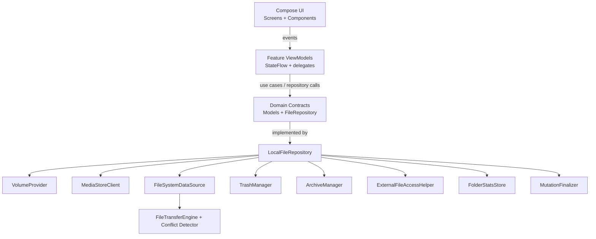

# Arcile - Developer Documentation

> Architecture, implementation notes, conventions, and verification guidance for Arcile development.

**Version:** 1.2.6 | **Last Updated:** 2026-06-28
**Scope:** Internal development, storage architecture, UI paradigms, testing, and release maintenance.

---

## Table of Contents

- [Architecture Overview](#architecture-overview)
- [Project Structure](#project-structure)
- [Runtime Flow](#runtime-flow)
- [Core Concepts](#core-concepts)
- [Navigation & State](#navigation--state)
- [Storage & File Operations](#storage--file-operations)
- [Room Cache Database](#room-cache-database)
- [Archive System](#archive-system)
- [Trash System](#trash-system)
- [Plugin System](#plugin-system)
- [UI & Design System](#ui--design-system)
- [Feature Modules Deep Dive](#feature-modules-deep-dive)
- [Naming Conventions](#naming-conventions)
- [Configuration](#configuration)
- [Security & Privacy Practices](#security--privacy-practices)
- [Error Handling](#error-handling)
- [Testing Suite](#testing-suite)
- [Build & Release Engineering](#build--release-engineering)
- [Intended Changes & Anomalies](#intended-changes--anomalies)
- [Project Auditing & Quality Standards](#project-auditing--quality-standards)
- [Troubleshooting](#troubleshooting)
- [Maintenance Notes](#maintenance-notes)
- [Feedback](#feedback)

---

## Architecture Overview

Arcile is a **modular multi-module Android app** with strict Gradle-enforced architecture boundaries. It is designed with clean MVVM, feature-scoped ViewModels, Hilt dependency injection, StateFlow-backed UI state, and data-source encapsulation.



### Key Architectural Decisions

| Decision | Rationale |
|----------|-----------|
| **Multi-module Gradle Architecture** | Enforces clean boundaries between features and core services, isolates compilation units, speeds up incremental builds, and prevents architectural degradation as features expand. |
| **Feature-scoped ViewModels** | Browser, Home, Recent Files, Trash, Quick Access, Archive Viewer, Onboarding, Image Gallery, Storage Cleaner, and Settings each own their own state and action flow. |
| **Repository Facade** | `LocalFileRepository` coordinates volume lookup, MediaStore queries, direct filesystem mutations, trash, folder stats, and archive operations. |
| **Typed Navigation** | `AppRoutes.kt` uses `kotlinx.serialization` route objects instead of raw route strings to verify routing correctness at compile time. |
| **Offline-first Privacy** | The manifest does not request `android.permission.INTERNET`; app behavior is local-only by design. |
| **Foreground Operation Pipeline** | Long-running copy, move, archive, extract, and fake-file work runs through a dedicated foreground service and emits progress updates. |
| **Room Database Caching** | Cache metadata, aggregate folder sizes, categories, and thumbnail listings are persisted in a local Room database to prevent repeated, expensive disk scans. |
| **Intent-based Plugins** | Optional heavyweight viewers run as separately installed, same-signer APKs and communicate through versioned explicit intents and temporary read-only content URI grants. |

---

## Project Structure

Arcile's codebase is divided into **23 Gradle modules** split into application entry, core components, independent feature modules, and optional plugin infrastructure:

```text
arcile/
├── arcile-app/
│   ├── build-logic/                             # Convention plugins for build script sharing
│   │   └── src/main/kotlin/                     # Arcile Android application convention plugin
│   ├── app/                                     # App entry point, Hilt composition, and shell UI
│   │   ├── src/main/java/dev/qtremors/arcile/
│   │   │   ├── ArcileApp.kt                     # Hilt application startup & image loader (Coil video thumb setup)
│   │   │   ├── MainActivity.kt                  # App activity, splash preloading, and main layout navigation shell
│   │   │   ├── SaveToArcileActivity.kt          # Shares/Handoff target helper for saving files locally
│   │   │   ├── presentation/                    # Shell Presentation layout
│   │   │   │   ├── ui/                          # AppNavigationGraph, ArcileAppShell, and Permission banners
│   │   │   │   ├── operations/                  # Foreground services and operation journal tracking
│   │   │   │   │   ├── BulkFileOperationService # Foreground Service doing the heavy operations
│   │   │   │   │   └── BulkFileOperationCoordinator # Coordinator API start/cancels
│   │   │   │   └── settings/                    # Settings UI modules
│   │   │   └── di/                              # AppModule, CoroutinesModule, StorageModule
│   ├── core/                                    # Shared business logic and UI frameworks
│   │   ├── runtime/                             # Dispatcher injection, app logger, and common helpers (UiText, AppLogger)
│   │   ├── ui/                                  # Common UI design tokens, theme, haptics, and reusable Compose components
│   │   │   ├── src/main/java/dev/qtremors/arcile/
│   │   │   │   ├── image/                       # Coil thumbnail policies, target sizes, state persistence
│   │   │   │   └── shared/ui/                   # Reusable widgets: ArcileTopBar, EmptyState, ConflictCard, ExpandableFabMenu
│   │   │   └── testing/                         # Shared compose test theme helper (ArcileTestTheme)
│   │   ├── navigation/
│   │   │   └── api/                             # Serializable typed routes (AppRoutes)
│   │   ├── presentation/
│   │   │   └── api/                             # FolderTabs, LocalSearchHelper, DeleteFlowDelegate, PropertiesUiModel
│   │   ├── testing/                             # Shared unit test fakes (FakeFileRepository, FakeBulkFileOperationCoordinator)
│   │   ├── operation/                           # Foreground operation coordinator implementation
│   │   │   └── api/                             # Task progress events (BulkFileOperationEvent) and operation models
│   │   └── storage/                             # File system data orchestrator
│   │       ├── domain/                          # Domain models, volume references, and repository interfaces
│   │       └── data/                            # FileSystem, MediaStore client, volume discovery, and transfers
│   │           ├── db/                          # Room Database cache (ArcileDatabase, FolderStatsDao, etc.)
│   │           ├── manager/                     # ArchiveManager, SevenZipHandler, ZipArchiveHandler, TrashManager
│   │           ├── provider/                    # VolumeProvider (mounted storage lookup)
│   │           ├── source/                      # MediaStoreClient, FileSystemDataSource, FileTransferEngine
│   │           └── util/                        # PathSafety, VolumeUtils
│   ├── plugin-api/                              # Dependency-free intent contract, version, and metadata models
│   ├── shared/                                  # Stateless viewer UI shared across APK boundaries
│   ├── plugin-glb/                              # Independent GLB Viewer Android application
│   └── feature/                                 # Feature Gradle modules with isolated ViewModels and screens
│       ├── archive/                             # ZIP/7z creation, password prompt, extraction UX
│       ├── browser/                             # File browser layout, selection bar, clipboard, and folder tabs
│       ├── imagegallery/                        # Image gallery albums/photos grid, dynamic timeline grouping, custom covers
│       ├── onboarding/                          # First-run setup and permission guidance
│       ├── quickaccess/                         # Pinned folders, SAF bookmarks, and folder shortcuts
│       ├── recentfiles/                         # Scoped recent files timeline and visual carousel
│       ├── storagecleaner/                      # Scanner/cleanup of Marker files, Empty folders, Duplicates (SHA-256)
│       ├── storageusage/                        # Storage dashboard and sunburst radial usage-map UI
│       └── trash/                               # Custom trash listings, restore workflows, properties, and destination picker
├── docs/                                        # Landing page website files
├── beta/                                        # Beta phase archived changelog & releases
├── CHANGELOG.md                                 # Stable release changelog
├── DEVELOPMENT.md                               # Architecture & development guide (This Document)
├── Releases.md                                  # Stable user-facing release notes
├── TASKS.md                                     # Roadmap, tracker of issues and features
└── README.md                                    # Main entry point overview
```

---

## Runtime Flow

1. **Splash Screen Preloading:** `MainActivity` installs the Android splash screen and preloads theme preferences and onboarding settings asynchronously from Jetpack DataStore (enforced with a 2-second fallback timeout) to prevent UI flicker.
2. **Onboarding Gate:** If the user hasn't completed onboarding, `OnboardingScreen` guides them through welcome slides, All Files Access settings, and notification permissions (Android 13+).
   - *Auto-Detection:* If the app discovers permissions are already active, onboarding automatically completes.
   - *Manual Reset:* Users can reset onboarding in settings.
3. **App Shell Assembly:** Once permissions are granted, `ArcileAppShell` sets up the typed navigation graph and the bottom navigation bar.
4. **Horizontal Pager Navigation:** The main screen (`MainScreen`) uses a two-page `HorizontalPager` hosting **Home** (Page 0) and **Browser** (Page 1).
   - If seeded by category shortcuts, deep links, or quick access paths, the pager opens on the Browser and populates the history. Swiping or standard back presses returns the user to Home or the previous browser directory.
5. **Route-Order Back Stack:** Browser handoffs from Cleaner, Recent Files, Quick Access, Storage Dashboard, Archive Viewer, and similar detail routes keep the originating app route on the Navigation Compose back stack. Browser consumes local modal/search/selection and folder/archive history first, then lets the app route pop back in the same order the user navigated.

---

## Core Concepts

### Storage Scopes

`StorageScope` represents the query bounds for file retrieval, search, or storage calculations:

| Scope | Kotlin Model | Purpose |
|-------|--------------|---------|
| **All Storage** | `StorageScope.AllStorage` | All indexed permanent volumes. |
| **Volume Scoped** | `StorageScope.Volume(volumeId)` | A specific storage volume (e.g., Internal vs SD Card). |
| **Path Scoped** | `StorageScope.Path(volumeId, absolutePath)` | A concrete directory path within a volume. |
| **Category Scoped** | `StorageScope.Category(volumeId, category)` | A conceptual category (Images, Videos, Audio, Docs, Archives, APKs). |

### Volume Classification

Arcile classifies storage volumes as either permanent or temporary to determine deletion and analytics routing:

- **Permanent Storage:** Internal storage and SD cards. Surfaced in storage dashboard metrics, included in category analytics, and supported by the Trash system.
- **Temporary Storage:** USB OTG, external drives, and unclassified mounts. Excluded from global dashboard calculations by default. File deletion on temporary storage is routed to delete permanently, completely bypassing the trash folder.

*Configuration:* `StorageClassificationRepository` persists user volume classifications, and `VolumeProvider` loads them into runtime `StorageVolume` models.

---

## Navigation & State

Type-safe navigation is built with `kotlinx.serialization` on Jetpack Navigation Compose.

### Route Definitions (`AppRoutes.kt`)
The navigation endpoints are modeled as serializable classes/objects under the `AppRoutes` namespace:
- `AppRoutes.Main(initialPage, path, archivePath, category, volumeId, focusPath, restorePersistentLocation, seedInitialPathHistory)`
- `AppRoutes.Home`
- `AppRoutes.Explorer(path, category, volumeId, restorePersistentLocation)`
- `AppRoutes.Tools`
- `AppRoutes.Settings`
- `AppRoutes.Trash`
- `AppRoutes.RecentFiles(volumeId)`
- `AppRoutes.ImageGallery(volumeId)`
- `AppRoutes.ImageViewer(initialPath, albumPath, searchQuery, volumeId, returnToBrowserPage)`
- `AppRoutes.StorageDashboard(volumeId)`
- `AppRoutes.StorageCleaner`
- `AppRoutes.StorageManagement`
- `AppRoutes.QuickAccess`
- `AppRoutes.ArchiveViewer(archivePath)`
- `AppRoutes.About`
- `AppRoutes.Licenses`

### Screen Transitions & Animation Rules
To maintain premium design aesthetics, Arcile implements customized bouncy spring transitions:
- **Detail Screens** (Dashboard, Settings, Archive Viewer): Slide horizontally with volumetric scale modifiers (`scaleIn` starting at 0.94f and `scaleOut` expanding to 1.04f).
- **Utility / Modals** (Trash, Recents, Gallery, Cleaner): Slide vertically from the bottom edge (`initialOffsetY = { it / 8 }`).
- **Reduced Motion Support:** All transitions check `LocalReducedMotionEnabled.current` and fall back to zero-duration crossfades if enabled in system or app settings.
- **Browser Handoff Back Rules:** Back from a Browser handoff first closes local Browser UI, then moves up folder/archive history, and only then returns to the previous app route. Volume-root fallback is reserved for Browser sessions without a previous app route so route sequences such as `a > b > c > d > e` unwind as `e > d > c > b > a`.

---

## Storage & File Operations

### Repository Facades
`LocalFileRepository` implements `FileRepository` along with focused sub-interfaces (`FileBrowserRepository`, `FileMutationRepository`, etc.). It acts as a coordinator delegating to:

- `VolumeProvider`: Discovers mounted storage volumes, resolves pathways, and parses volume details.
- `MediaStoreClient`: Queries MediaStore for files, recent assets, categories, and folder statistics.
- `FileSystemDataSource`: Conducts direct JVM `java.io.File` mutations (make file, folder, rename, and delete).
- `FolderStatsStore`: Manages async aggregate size calculations.
- `TrashManager`: Handles custom volume-scoped trash.
- `ArchiveManager`: Coordinates archive packaging and extraction.
- `ExternalFileAccessHelper`: Manages temporary handoffs and staging caches.
- `MutationFinalizer`: Updates media scanners and database tables post-mutation.

### Conflict Detection & Resolution Preflight
To prevent accidental data loss, file conflict resolution runs *before* operations execute:
1. `detectCopyConflicts` performs a high-speed top-level name comparison in the destination directory to identify collisions before starting heavy recursive jobs.
2. The user resolves conflicts in the `PasteConflictDialog` with options to **Replace**, **Keep Both**, or **Skip** (supports batch application).
3. `FileConflictNameGenerator` resolves Keep Both options into stable name modifications (e.g. `image (1).png`).

---

## Room Cache Database

To avoid repeated recursive file-system scans, Arcile uses a local Room database `ArcileDatabase` (file: `arcile-cache.db`, schema version 2) to cache directories and calculations.

Room schemas are exported under `core/storage/data/schemas/` and checked into source control. Cache schema changes are release events: every database version bump must include an updated schema JSON file, a migration or explicit cache-reset test from the previous version, and a changelog note explaining whether cached rows are preserved or intentionally invalidated. Destructive cache invalidation is acceptable for disposable cache data only when it is scoped to the known previous version with `fallbackToDestructiveMigrationFrom(...)`.

### Database Entities

#### FolderStatsEntity
Caches computed directory details (item counts and sizes).
- **Table Name:** `folder_stats`
- **Fields:**
  - `path: String` (PrimaryKey)
  - `file_count: Long`
  - `total_bytes: Long`
  - `cached_at: Long`
  - `status: String` (domain `FolderStatsStatus` mapping)

#### StorageNodeEntity
Caches directory contents for faster rendering and search.
- **Table Name:** `storage_nodes`
- **Indices:** `parent_path`, `volume_id`, `content_uri`, `media_store_id`, `last_modified`
- **Fields:**
  - `path: String` (PrimaryKey)
  - `parent_path: String?`
  - `name: String`
  - `extension: String`
  - `mime_type: String?`
  - `size_bytes: Long`
  - `last_modified: Long`
  - `is_directory: Boolean`
  - `is_hidden: Boolean`
  - `content_uri: String?`
  - `media_store_id: Long?`
  - `media_store_volume: String?`
  - `volume_id: String?`
  - `width: Int?`
  - `height: Int?`
  - `date_added: Long?`
  - `scanned_at: Long`
  - `stale: Boolean`

#### CategorySummaryEntity
Stores aggregated stats for file types across volumes.
- **Table Name:** `category_summaries`
- **Primary Keys:** `scope_key`, `category_name`
- **Fields:**
  - `scope_key: String`
  - `category_name: String`
  - `size_bytes: Long`
  - `item_count: Long`
  - `cached_at: Long`

#### ThumbnailEntryEntity
Tracks cached visual previews for images, video frames, and document pages.
- **Table Name:** `thumbnail_entries`
- **Indices:** `source`, `content_uri`, `last_modified`, `last_success_at`, `last_failure_at`
- **Fields:**
  - `identity_key: String` (PrimaryKey)
  - `source: String`
  - `extension: String`
  - `size_bytes: Long`
  - `last_modified: Long`
  - `content_uri: String?`
  - `type: String`
  - `last_success_at: Long?`
  - `last_failure_at: Long?`
  - `failure_count: Int`
  - `failure_message: String?`

#### ThumbnailVariantEntity
Tracks size variations of cached thumbnails for responsive UI loading.
- **Table Name:** `thumbnail_variants`
- **Foreign Key:** `identity_key` referencing `thumbnail_entries.identity_key` with `ON DELETE CASCADE`
- **Indices:** `identity_key`, `last_accessed_at`
- **Fields:**
  - `variant_key: String` (PrimaryKey)
  - `identity_key: String`
  - `size_bucket_px: Int`
  - `generated_at: Long`
  - `last_accessed_at: Long`

---

## Archive System

Arcile supports browsing, creating, and extracting multiple archive formats:
- **Supported Formats (`ArchiveFormat`):**
  - *Full Support (Browse + Create + Extract):* ZIP (with Zip4j AES password support), 7z (with password support), TAR, TAR.GZ (TGZ), TAR.BZ2 (TBZ2), and TAR.XZ (TXZ).
  - *Read-only Support (Browse + Extract):* GZIP (GZ), BZIP2 (BZ2), and XZ.
  - *Unsupported Format (Mapped but disabled):* RAR.
- **Archive Encoding (`ArchiveNameEncoding`):** Users and developers can configure custom filename character sets: UTF-8, CP437, Windows-1252, Shift JIS, GBK, and Big5.
- **Compression Levels (`ArchiveCompressionLevel`):** STORE (No compression), FAST, DEFAULT (Balanced), and MAXIMUM.
- **Metadata Inspection:** `getArchiveSummary` parses format configurations, entry counts, and encryption profiles without unpacking the archive.
- **Selective Listing:** `listArchiveEntries` lists contents page-by-page and supports directory traversal within the archive.
- **Extraction Safety:** The extraction pipeline validates every entry using `PathSafety.isArchiveEntrySafe` to block Zip Slip directory traversal attacks (absolute path escapes, `..` patterns).
- **Keep Both Naming:** If extraction targets already exist, they are auto-renamed using `FileConflictNameGenerator` to prevent accidental overwrites.
- **Pre-scan Limits:** Preflight scan limits before archive creation: `ARCHIVE_CREATION_PRE_SCAN_MAX_ENTRIES` (max 2048 entries) and `ARCHIVE_CREATION_PRE_SCAN_MAX_BYTES` (max 512MB).

---

## Trash System

Custom Trash is enforced on all permanent volumes:
- **Storage Layout:** Trashed files are moved to `.arcile/.trash` at the volume root, with original attributes and paths stored in JSON sidecars in `.arcile/.metadata`.
- **Media Scanner Protection:** A `.nomedia` file is created in trash folders to prevent trashed files from appearing in third-party gallery applications.
- **Restore Logic:** Reads metadata sidecars and moves files back to their original locations.
  - If the original parent directory was deleted, a `DestinationRequiredException` is thrown, prompting the user to select a new folder.
  - Conflicts are resolved using Keep Both renaming.
- **Undo Operations:** Trash actions can be immediately undone using snackbar options before the directory caches invalidate.

---

## Plugin System

Arcile plugins are independent Android application APKs. They are discovered and launched through Android intents; Arcile never loads plugin classes, resources, or native libraries into its own process.

### Modules and Ownership

| Module | Responsibility |
|--------|----------------|
| `plugin-api` | Stable contract constants, API version, MIME constants, and immutable plugin metadata/status models. It must not acquire runtime library dependencies. |
| `shared` | Stateless Compose viewer primitives that can be packaged into both Arcile and plugin APKs. It must not depend on app storage, feature modules, Hilt, or privileged file APIs. |
| `app` | Plugin discovery, signature/API validation, file routing, temporary URI creation, missing/update prompts, and Settings management UI. |
| `plugin-glb` | GLB rendering, plugin request validation, viewer UI, and share/open-with handoffs. SceneView and Filament belong only here. |

The current contract version is `PluginContract.PLUGIN_API_VERSION = 1`.

### Intent Contract

Plugins expose an exported activity with the registration action:

```text
dev.qtremors.arcile.plugin.REGISTER
```

Arcile launches the discovered activity explicitly with:

```text
Action: dev.qtremors.arcile.plugin.VIEW_FILE
Data: content:// URI
Type: resolved MIME type
Flag: Intent.FLAG_GRANT_READ_URI_PERMISSION
ClipData: the same content URI
```

The following namespaced extras accompany the data URI:

| Extra | Type | Meaning |
|-------|------|---------|
| `dev.qtremors.arcile.plugin.extra.FILE_URI` | `Uri` | Read-only file URI; intent data remains the primary source. |
| `dev.qtremors.arcile.plugin.extra.FILE_NAME` | `String` | User-facing display name. |
| `dev.qtremors.arcile.plugin.extra.MIME_TYPE` | `String` | Normalized MIME type. |

Registration metadata:

| Key | Format |
|-----|--------|
| `dev.qtremors.arcile.plugin.API_VERSION` | Integer plugin API version. |
| `dev.qtremors.arcile.plugin.NAME` | Display name or string resource. |
| `dev.qtremors.arcile.plugin.SUPPORTED_MIME_TYPES` | Lowercase comma-separated MIME types; type wildcards such as `image/*` are allowed. |
| `dev.qtremors.arcile.plugin.SUPPORTED_EXTENSIONS` | Lowercase comma-separated extensions without leading dots. |
| `dev.qtremors.arcile.plugin.HOMEPAGE` | Optional project or release URL. |

`PackageInfo.versionName` and `longVersionCode` are authoritative for the plugin version. Do not duplicate them in metadata.

### Discovery, Compatibility, and Security

1. Arcile declares the registration action under `<queries>` for Android 11+ package visibility.
2. `PluginManager` calls `queryIntentActivities()` with metadata enabled.
3. Disabled/non-exported activities, malformed metadata, and unsigned or differently signed packages are rejected.
4. A plugin is launchable only when its API version exactly matches the current contract.
5. Matching prefers exact MIME, then extension, then MIME wildcard; version code and package name provide deterministic tie-breaking.
6. File access is staged through Arcile's read-only `ExternalFileAccessProvider`. Plugins must accept `content://` URIs and must not request all-files access.

Arcile and every official plugin release must use the same signing certificate. Debug variants naturally use the shared debug certificate. Release signing reads `signing.properties`, then `local.properties`; absolute and app-relative keystore paths are supported.

### Creating a Plugin

1. Add an Android application module under `arcile-app/`, include it in `settings.gradle.kts`, and give it a unique application ID such as `dev.qtremors.arcile.plugin.stl`.
2. Depend on `:plugin-api`; add `:shared` only when the plugin uses Arcile viewer primitives.
3. Add one exported registration/viewer activity. A viewer intended only for Arcile must not declare `MAIN`, `LAUNCHER`, or a generic `ACTION_VIEW` filter.
4. Declare all registration metadata on that activity.
5. Validate the custom action, `content` URI scheme, MIME/extension, and readability before rendering.
6. Keep heavyweight rendering/codec dependencies inside the plugin module.
7. Add contract, request-validation, rendering-failure, and build tests.
8. Add the plugin to `PluginManager.catalog` only when Arcile should advertise installation while it is absent.

Minimal manifest registration:

```xml
<activity
    android:name=".ViewerActivity"
    android:exported="true">
    <intent-filter>
        <action android:name="dev.qtremors.arcile.plugin.REGISTER" />
        <category android:name="android.intent.category.DEFAULT" />
    </intent-filter>
    <meta-data
        android:name="dev.qtremors.arcile.plugin.API_VERSION"
        android:value="1" />
    <meta-data
        android:name="dev.qtremors.arcile.plugin.NAME"
        android:value="@string/plugin_name" />
    <meta-data
        android:name="dev.qtremors.arcile.plugin.SUPPORTED_MIME_TYPES"
        android:value="model/stl" />
    <meta-data
        android:name="dev.qtremors.arcile.plugin.SUPPORTED_EXTENSIONS"
        android:value="stl" />
</activity>
```

Build and test the current GLB plugin:

```bash
./gradlew :plugin-api:testDebugUnitTest :plugin-glb:testDebugUnitTest
./gradlew :plugin-glb:assembleDebug
./gradlew :plugin-glb:assembleRelease
```

Before publishing, install the Arcile and plugin release APKs together, verify their certificate digests match with `apksigner verify --print-certs`, exercise missing/incompatible flows, render a real file, share/open-with it, and confirm Back returns to Arcile.

---

## UI & Design System

Arcile implements a high-end, premium design system built on **Material 3 Expressive** design tokens, custom spring physics, responsive gesture mechanics, and wallpaper-reactive accents.

### 1. Theme & Customization Engine (`Theme.kt`, `ThemeState`)
- **Theme Modes:**
  - `LIGHT`, `DARK`, `SYSTEM`: Dynamically updates layouts and system status/navigation bars via `WindowCompat`.
  - `OLED`: Pure-black overrides that set the background, surface, and container variants to `Color.Black` for maximum battery savings and deep-contrast aesthetics.
- **Visual Presets:**
  - `DRACULA` & `TOKYO_NIGHT`: Premium preconfigured developer color palettes, each featuring standard dark and OLED-specialized color maps.
  - `CUSTOM`: Allows the user to specify hexadecimal colors for primary and background tones. The engine dynamically calculates the contrast text color (`getContrastColor`) using a relative luminance formula: `luminance = (R * 0.299f) + (G * 0.587f) + (B * 0.114f)`. Backgrounds above `0.5f` luminance resolve to black text, others to white.
- **Accent Color Routing:**
  - *Dynamic Accent:* Blends with Android 12+ wallpaper dynamic palettes via `dynamicLightColorScheme(context)` and `dynamicDarkColorScheme(context)`.
  - *Monochrome / Monochrome OLED Scheme:* Clean greyscale layouts.
  - *Predefined Colors:* Blue, green, purple, orange, etc., dynamically built into a Material 3 palette via a helper seed builder.
- **Color Harmonization:**
  - When `harmonizeColors` is enabled in `ThemeState`, category-specific colors (e.g., folder item types) and semantic colors are blended with the primary color scheme using color harmonization to prevent visual clashes.
- **Composition Locals:**
  - `LocalCategoryColors` / `LocalSemanticColors`: Resolved color lists.
  - `LocalSpacing`: Access spacing coordinates.
  - `LocalHapticsEnabled` / `LocalHapticFeedback`: Tracks and respects user vibration settings.
  - `LocalDoubleLineFilenames` / `LocalMarqueeFilenames`: Inject configuration properties into file list rows.
  - `LocalReducedMotionEnabled`: Checks system accessibility flags to skip animations if requested by the OS.

### 2. Motion & Animation Tokens (`Motion.kt`, `AnimationTokens`)
- **Bouncy Spring Physics:** Standard Jetpack Compose spring animations are customized with under-damped bouncy physics (`dampingRatio = 0.75f`, `stiffness = Spring.StiffnessMediumLow`) to make press interactions feel tactile and alive.
- **Bouncy Card Press Actions (`bounceClickable`):** Interactive cards, cleaner category selectors, and grid cells use a custom press-to-scale modifier that shrinks the component slightly and plays a subtle haptic click (`HapticUtils`) on touch down and up.
- **Margin & Padding Safeguards:** Animated margins, paddings, or grid dimensions are coerced to be non-negative (e.g., `coerceAtLeast(0.dp)`) to prevent spring overshoots from sending layout coordinates below zero and triggering layout crashes.
- **Transition States:**
  - **Volumetric Scale:** Navigating to details scales screens using `scaleIn(initialScale = 0.94f)` and `scaleOut(targetScale = 1.04f)`.
  - **Predictive Back Navigation:** Core screens (Browser, Gallery, Recents, Trash, Archive Viewer) integrate with Android's progressive back gestures, scaling, translating, and fading the active layouts in real-time response to back swipes.

### 2. Custom Layout Components
- **Split Selection Toolbar (`SplitButtonGroup`):** Standardizes multiple primary bulk actions (e.g., Copy, Cut, Delete, Edit) into cohesive side-by-side button segments with a detached circular dropdown menu for secondary operations, floating freely above lists.
- **Expandable FAB Menu (`ExpandableFabMenu`):** An animated floating action button that rotates 45 degrees upon expansion, revealing secondary actions (New Folder, New File, Create Archive, etc.) styled as vertical circular items that fade and slide into place.
- **Glassmorphic Bottom Navigation (`ArcileNavigationBar`):** A floating bottom navigation container utilizing blurred translucent glass backdrops.
  - *Collapsible Labels:* To minimize clutter, inactive tabs collapse their text labels, displaying only the icon. The active tab expands to show both icon and title with a smooth spring-based width transition.
- **Draggable Fast Scrollbar (`FileList`, `FileGrid`):** A custom fast scroll track aligned with staggered grids and lists. As the user drags the scroll thumb, a floating date pill tooltip (displaying `Month Year`, e.g., `June 2026`) is projected nearby, updating dynamically as the scroll position transitions.
- **Shimmering Segmented Storage Bar (`StorageProgressBar`):** A custom progress bar on the Home screen that displays a shimmering loading animation on startup. When the filesystem stats resolve, the bar morphs into a segment-colored indicator representing space occupied by Images, Videos, Audio, Documents, Archives, APKs, and System files.

### 3. Gesture Physics & Interactive Components
- **Pinch-to-Resize Columns:** Photos and Albums grids in the Image Gallery feature real-time multi-touch pinch-to-resize gestures. Pinch-in and pinch-out gestures scale the layout's grid columns dynamically with spring feedback.
- **Elastic Viewer Dismissal (`ImageViewerScreen`):** The fullscreen media viewer is gesture-driven:
  - *Double-Tap Zoom:* Double-tapping on an image zoom-targets the tapped coordinate.
  - *Boundary-Resisting Pan:* Dragging an zoomed image past its bounds shows elastic drag resistance.
  - *Vertical Swipe-to-Dismiss:* Swiping down or up on an unzoomed image triggers an elastic dismiss animation, scaling and sliding the image while fading the black backdrop.
- **Viewer Thumbnail Strip:** The bottom thumbnail filmstrip uses stable absolute-path keys, fixed item layout dimensions, no thumbnail crossfade, immediate centered jumps for far-opened gallery items, and animated scrolling only for nearby page changes.
- **EXIF Slide-up Page Pager (`ImageViewerMetadata`):** The details panel wraps camera parameters and EXIF details inside a `VerticalPager` with scroll snapping. Swiping up on the viewer page slides the metadata panel upward, pushing the image above it. Swiping down slides the panel away.

### 4. UI/UX Rules & Guidelines for Developers
- **Hidden File Alpha:** Files or folders starting with a dot (`.`) are styled with lower opacity (typically `0.6f` alpha) and styled with italic text to distinguish them from standard files.
- **Scroll Preservation:** When returning from sub-screens (e.g., returning to the Browser from the Image Viewer, or to the Gallery from a photo), the list/grid scroll position (index and pixel offset) is preserved.
- **Gesture Blocking:** Categories or specific path-scoped navigations temporarily disable the main horizontal pager's swipe actions (`userScrollEnabled = false`) to prevent accidental transitions while browsing files.
- **App Risk Mapping:** In the Storage Cleaner, package names are mapped to user-friendly local application icons (e.g., resolving WhatsApp package to its recognizable icon) and risk badges, rather than listing raw package labels.

### 5. Material 3 Expressive APIs & Typography Guidelines
- **`ExperimentalMaterial3ExpressiveApi` Coverage:** This API tag is opted-in across features to access next-generation components, including:
  - `LoadingIndicator`: A vector-animated loading state spinner replacing the traditional circular progress indicators with premium motion curves.
  - `PullToRefreshBox` & `rememberPullToRefreshState`: Expressive gestures-based pull containers featuring customizable progress physics.
- **Expressive Motion Specs (`Motion.kt`):**
  - *Duration Scale:* Ranging from `Short1` (100ms), `Short2` (150ms), `Short3` (200ms), `Medium1` (250ms), `Medium2` (300ms), `Medium3` (350ms), `Medium4` (400ms), to `Long1` (450ms) through `Long4` (600ms).
  - *Easing Curves:* Maps Google's Expressive specs: `Emphasized` and `EmphasizedDecelerate` curves govern entrance transitions, while `EmphasizedAccelerate` controls exit transitions.
- **Semantic Typography (`Type.kt`):**
  Developers must use semantic text styles defined as extensions on the Material 3 `Typography` configuration to keep screens consistent:
  - `Typography.filename`: `titleMedium` styling with `Medium` weight and zero letter spacing, optimized for files and folders.
  - `Typography.fileMetadata`: `bodySmall` styling with normal weight, reserved for file sizes, timestamps, and extensions.
  - `Typography.pathBreadcrumb`: `labelLarge` styling with `Medium` weight, used in breadcrumb bars.
  - `Typography.storageMetric`: `headlineMedium` styling with `SemiBold` weight, for storage numbers.
  - `Typography.sectionHeader`: `titleSmall` styling with `Bold` weight, for screen headers and settings groups.
  - `Typography.dangerLabel`: `labelLarge` styling with `SemiBold` weight, indicating file deletion, junk counts, or risks.
  - *Bold/Semi-bold helpers:* `titleLargeBold`, `titleMediumBold`, `titleMediumSemiBold`, `titleSmallSemiBold`, `bodyLargeMedium`, `bodyMediumBold`, and `bodySmallMedium`.

---


## Feature Modules Deep Dive

### 1. Onboarding (`feature/onboarding`)
- **UI Architecture:** `OnboardingScreen` features a multi-page setup wizard with step indicators.
- **ViewModel:** `OnboardingViewModel` manages permissions and transitions.
- **Logic:** Requests storage and notification permissions. Automatically marks onboarding complete if permissions are already active.

### 2. Browser (`feature/browser`)
- **UI Architecture:** `BrowserScreen` displays files in customizable lists or grids with a floating bottom action bar and an expandable FAB.
- **ViewModel:** `BrowserViewModel` coordinates delegates for browser features.
- **Delegates:**
  - `NavigationDelegate`: Manages folder hierarchy traversal, categories, and deep links.
  - `ClipboardDelegate`: Manages copy/cut states and resolves conflict preflights.
  - `SearchDelegate`: Filters local files and searches MediaStore.
  - `ArchiveActionDelegate`: Coordinates archive creation and password validation.
  - `UndoDelegate`: Manages undo actions for file operations.

### 3. Image Gallery (`feature/imagegallery`)
- **UI Architecture:** A modular gallery interface containing `ImageGalleryAlbumsGrid`, `ImageGalleryTimeline`, and `ImageGalleryViewOptions`.
- **ViewModel:** `ImageGalleryViewModel` manages media catalogs.
- **Logic:** Group media by day, week, or month, customizable album covers, virtual Favorites album, and pinch-to-zoom grid scaling.

### 4. Image Viewer (`feature/imagegallery` - Viewer segment)
- **UI Architecture:** Immersive fullscreen `ImageViewerScreen` with a zoomable viewport, scrolling filmstrip, and EXIF panel.
- **Logic:** Elastic drag-to-dismiss gestures, camera properties extraction, and location parameter scrubbing.

### 5. Storage Cleaner (`feature/storagecleaner`)
- **UI Architecture:** A central scanner hub showing categories (Large Files, Downloads, Duplicate Files, Marker Files, Empty Folders) with a comparison sheet.
- **Logic:** Identifies duplicate files using size, byte samples, and SHA-256 hashes. Resolves app-associated folders and manages exclusion lists.

### 6. Storage Usage Map (`feature/storageusage`)
- **UI Architecture:** Radial segment sunburst chart (`StorageUsageSunburst`).
- **Logic:** Displays interactive storage breakdowns by category.

### 7. Trash Hub (`feature/trash`)
- **UI Architecture:** `TrashScreen` displays trashed files with search and metadata (deleted date, original path).
- **Logic:** Handles batch restoration, permanent deletion, empty trash operations, and destination pickers.

### 8. Recent Files (`feature/recentfiles`)
- **UI Architecture:** Timeline view of recent modifications with category shortcuts.
- **Logic:** Surfaces recent items across active scopes.

### 9. Quick Access (`feature/quickaccess`)
- **UI Architecture:** Pinned folders list.
- **Logic:** Links custom shortcuts and SAF bookmarks.

### 10. External Share Target (`SaveToArcileActivity`)
- **UI Architecture:** A standalone target activity `SaveToArcileActivity` implementing a Scaffold layout with a `LargeTopAppBar` and standard folder navigation lists.
- **Logic:** Registers for standard Android sharing intents (`ACTION_SEND` and `ACTION_SEND_MULTIPLE`). When files are shared from external apps, it opens a customized folder picker allowing users to browse their mounted storage volumes and save the shared streams into their selected directory. Handles cursor lookup for file sizes and display names (`OpenableColumns`) and notifies the repository of mutations on completion.

---

## Naming Conventions

Arcile uses clear, descriptive names to ensure readability.

### Directory & File Names
- **Compose Screens:** PascalCase with `Screen` suffix (e.g. `TrashScreen.kt`).
- **Composables:** PascalCase without suffix (e.g. `ArcileTopBar.kt`).
- **ViewModels:** PascalCase with `ViewModel` suffix (e.g. `RecentFilesViewModel.kt`).
- **Repositories & Stores:** PascalCase with `Repository` or `Store` suffix (e.g. `FolderStatsStore.kt`).

### Method Signatures

| Prefix | Intent | Example |
|--------|--------|---------|
| `load` | Read state / data | `loadTrashItems()` |
| `navigate` | Transition screens | `navigateToFolder(path)` |
| `on` | Event callbacks | `onOpenFile` |
| `toggle` | Flip boolean state | `toggleSelection(file)` |
| `clear` | Reset variables | `clearClipboard()` |
| `create` | Build a resource | `createDirectory(name)` |
| `delete` | Remove a resource | `deletePermanently(paths)` |
| `get` | Fetch values | `getStorageInfo(scope)` |
| `format` | Convert data for display | `formatFileSize(bytes)` |
| `is` / `has` | Boolean checks | `isDirectory()`, `hasPermission()` |

---

## Configuration

### Compilation Metrics

| Attribute | Configuration Value |
|-----------|--------------------|
| **Namespace** | `dev.qtremors.arcile` |
| **Compile SDK** | 37 |
| **Target SDK** | 37 |
| **Min SDK** | 30 |
| **Version Code** | 126 |
| **Version Name** | `1.2.6` |
| **Java Target** | JVM 11 |
| **Kotlin Version** | 2.2.10 |
| **AGP Version** | 9.2.1 |
| **Compose BOM** | 2026.05.00 |

### Manifest Declarations

```xml
<!-- Storage Permissions -->
<uses-permission android:name="android.permission.MANAGE_EXTERNAL_STORAGE" />
<uses-permission android:name="android.permission.POST_NOTIFICATIONS" />
<uses-permission android:name="android.permission.FOREGROUND_SERVICE" />
<uses-permission android:name="android.permission.FOREGROUND_SERVICE_DATA_SYNC" />
<uses-permission android:name="android.permission.READ_EXTERNAL_STORAGE" android:maxSdkVersion="29" />
<uses-permission android:name="android.permission.WRITE_EXTERNAL_STORAGE" android:maxSdkVersion="29" />
```

*Important:* Arcile does **not** request `android.permission.INTERNET` to guarantee user privacy.

---

## Security & Privacy Practices

1. **Path Traversal Protection:** All file inputs are validated using `PathSafety.isPathSafe` to block path traversal attacks.
2. **Safe Decompression:** `isArchiveEntrySafe` rejects absolute entries and relative directory escapes (`..`) during archive extraction.
3. **External Handoff Encapsulation:** `file_provider_paths.xml` and the app-owned external handoff provider restrict external access to the cache-backed `external_access/` staging root; local open/share grants are copied through `external_access/open/` or `external_access/share/`, and staged shares expose only display-name and size metadata.
4. **Staging Cache Lifecycle:** Staged handoff files are tracked in stats and deleted when the staging cache is cleared or after a configurable retention period.
5. **No Telemetry:** The app has no network access, preventing data leaks.
6. **Room Database Security:** Caches exclude user keys and access credentials.
7. **Scoped Deletions:** OTG/temporary storage deletes files permanently instead of moving them to trash folders.

---

## Error Handling

- **ViewModels:** Catch repository exceptions and display them to users via UI states, dialogs, or snackbars.
- **Repository APIs:** Return `Result<T>` wrappers with custom exceptions (`DestinationRequiredException`, `PasswordRequiredException`).
- **Cancellation Safety:** Coroutine blocks catch and rethrow `CancellationException` to ensure proper coroutine cancellation.

```kotlin
try {
    executeMutation()
} catch (e: Exception) {
    if (e is CancellationException) throw e
    Result.failure(e)
}
```

---

## Testing Suite

Arcile features a comprehensive test suite of **unit, Robolectric, and instrumented UI tests**.

### Test Distribution

- **JVM Unit & Robolectric Tests:** 112 Kotlin test files (646 `@Test` annotations) covering ViewModels, delegates, managers, Room database migrations, metadata writing, zoom calculations, calendar grouping, and scrollbar behavior.
- **Instrumented UI Tests:** ~3 Kotlin test files verifying screen layouts on emulator/device.
- **Robolectric Configuration:** Compose Unit tests are pinned to SDK 35 (`@Config(sdk = [35])`) because Robolectric support can lag newer compile SDK releases.

### Verification Commands

```bash
# Full local suite: all module unit/Robolectric tests, lint, and verification checks
./gradlew check

# Entire suite including device/emulator instrumented tests
./gradlew check connectedCheck

# Run app-module unit and Robolectric tests only
./gradlew :app:testDebugUnitTest

# Validate production string assets (checks for non-resource text)
./gradlew checkProductionStrings

# Run app-module instrumented UI tests
./gradlew :app:connectedDebugAndroidTest
```

Use `./gradlew check` for normal local verification. Use `./gradlew check connectedCheck` for the entire suite when a device or emulator is available; `connectedCheck` runs instrumented Android tests across modules that define them. Process-death behavior is covered by focused Robolectric/unit gates where possible.

### Per-Module Test Commands

Use module-scoped tasks when iterating on a focused area:

```bash
# App shell and integration-facing app tests
./gradlew :app:testDebugUnitTest

# Core modules
./gradlew :core:storage:data:testDebugUnitTest
./gradlew :core:storage:domain:test
./gradlew :core:ui:testDebugUnitTest
./gradlew :core:presentation:api:testDebugUnitTest
./gradlew :core:navigation:api:test

# Feature modules
./gradlew :feature:browser:testDebugUnitTest
./gradlew :feature:imagegallery:testDebugUnitTest
./gradlew :feature:storagecleaner:testDebugUnitTest
./gradlew :feature:storageusage:testDebugUnitTest
./gradlew :feature:recentfiles:testDebugUnitTest
./gradlew :feature:archive:testDebugUnitTest
./gradlew :feature:trash:testDebugUnitTest
./gradlew :feature:onboarding:testDebugUnitTest
./gradlew :feature:quickaccess:testDebugUnitTest
./gradlew :plugin-api:testDebugUnitTest
./gradlew :plugin-glb:testDebugUnitTest

# Instrumented tests for modules that define androidTest sources
./gradlew :app:connectedDebugAndroidTest
./gradlew :feature:quickaccess:connectedDebugAndroidTest
```

Pure Kotlin/JVM modules use `test`; Android modules use `testDebugUnitTest` for local unit/Robolectric tests and `connectedDebugAndroidTest` for instrumented tests.

---

## Build & Release Engineering

To package Arcile and its optional GLB plugin:

```bash
# Generate Debug APKs
./gradlew :app:assembleDebug :plugin-glb:assembleDebug

# Generate signed, minified Release APKs
./gradlew :app:assembleRelease :plugin-glb:assembleRelease
```

### APK Naming Standards
- **Arcile Debug:** `app/build/outputs/apk/debug/Arcile-1.2.6-debug.apk`
- **Arcile Release:** `app/build/outputs/apk/release/Arcile-1.2.6.apk`
- **GLB Plugin Debug:** `plugin-glb/build/outputs/apk/debug/Arcile-GLB-Viewer-1.0.0-debug.apk`
- **GLB Plugin Release:** `plugin-glb/build/outputs/apk/release/Arcile-GLB-Viewer-1.0.0.apk`

---

## Intended Changes & Anomalies

| Aspect | Custom Implementation | Design Rationale |
|--------|-----------------------|------------------|
| **Public Trash Roots** | Trash directories reside at `/storage/emulated/0/.arcile/` instead of app-private folders. | Preserves trash items across app uninstall and reinstalls. |
| **OTG Deletion** | Removable USB OTG storage deletes files permanently. | Avoids creating hidden, persistent directories on removable drives. |
| **No Network Access** | The application does not declare the network permission. | Ensures user privacy by preventing files or metadata from being sent over the network. |

---

## Project Auditing & Quality Standards

When reviewing code changes, ensure:
1. **Scope Compliance:** Mutations must remain within target volume boundaries.
2. **Memory Efficiency:** Avoid loading large directories or image lists directly into memory; use paginated loaders or database cache lookups instead.
3. **Resource Management:** String literals should be defined in `strings.xml` to pass `checkProductionStrings` validation.

---

## Troubleshooting

- **Onboarding loops:** Check DataStore preferences state loading in `MainActivity` (ensure the 2-second timeout is not tripped).
- **Missing files:** Run a MediaStore sync via `MutationFinalizer` after making file mutations.
- **Archive errors:** Verify password credentials and check for path safety violations.
- **Build configuration errors:** Ensure Android SDK 37 is installed via the Android SDK Manager.

---

## Maintenance Notes

- **Changelogs:** Document all changes in `CHANGELOG.md` when preparing a release.
- **Version alignment:** Ensure the version code and name are consistent across `build.gradle.kts`, `DEVELOPMENT.md`, and `README.md`.
- **Archive handlers:** Keep extraction path validation intact for all archive formats.

---

## Feedback

Arcile is a solo project. Forking for personal use is welcome under the license terms, but external code contributions via pull requests are not accepted at this time.

To report bugs, request features, or suggest improvements, please open an issue on the [GitHub issue tracker](https://github.com/qtremors/arcile/issues).

---

<p align="center">
  <a href="README.md">Back to README</a>
</p>
