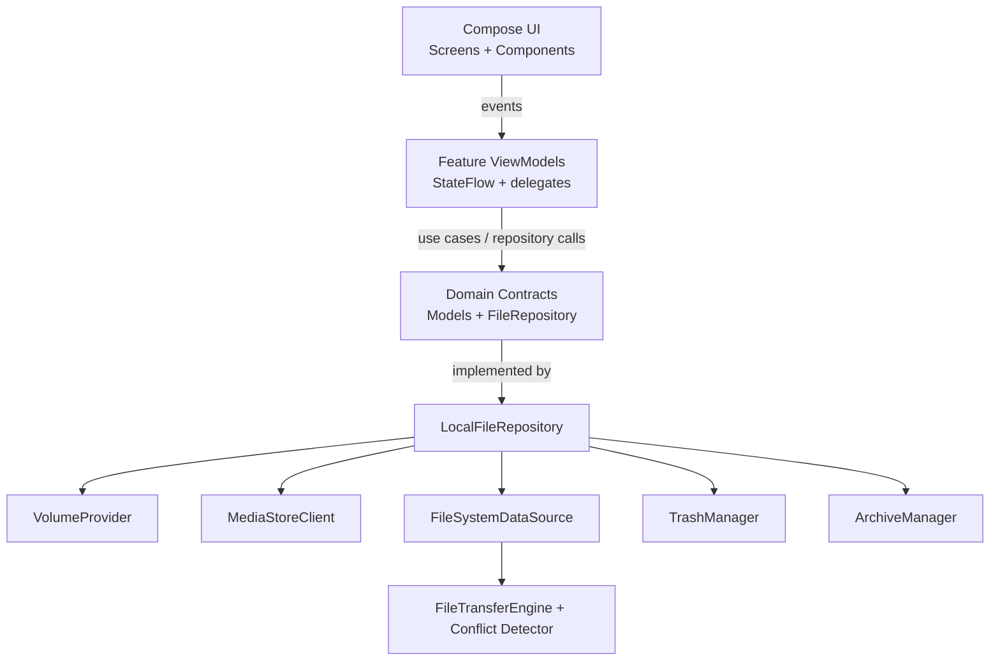

# Arcile - Developer Documentation

> Architecture, implementation notes, conventions, and verification guidance for Arcile development.

**Version:** 1.0.0 | **Last Updated:** 2026-06-07
**Scope:** Internal development, storage architecture, UI paradigms, testing, and release maintenance.

---

## Table of Contents

- [Architecture Overview](#architecture-overview)
- [Project Structure](#project-structure)
- [Runtime Flow](#runtime-flow)
- [Core Concepts](#core-concepts)
- [Navigation & State](#navigation--state)
- [Storage & File Operations](#storage--file-operations)
- [Archive System](#archive-system)
- [Trash System](#trash-system)
- [UI & Design](#ui--design)
- [Naming Conventions](#naming-conventions)
- [Configuration](#configuration)
- [Security Practices](#security-practices)
- [Error Handling](#error-handling)
- [Testing](#testing)
- [Build & Release](#build--release)
- [Intended Changes & Anomalies](#intended-changes--anomalies)
- [Project Auditing & Quality Standards](#project-auditing--quality-standards)
- [Troubleshooting](#troubleshooting)
- [Maintenance Notes](#maintenance-notes)
- [Feedback](#feedback)

---

## Architecture Overview

Arcile is a **modular multi-module Android app** with Gradle-enforced architecture boundaries. It uses MVVM, feature-scoped ViewModels, Hilt dependency injection, StateFlow-backed UI state, and repository/data-source separation.



### Key Decisions

| Decision | Rationale |
|----------|-----------|
| **Modular Gradle architecture** | Enforces clean boundaries between features and core services, isolates compilation units, speeds up incremental builds, and prevents architectural degradation as features expand. |
| **Feature-scoped ViewModels** | Browser, Home, Recent Files, Trash, Quick Access, Archive Viewer, Onboarding, and Settings each own their own state and actions. |
| **Repository facade** | `LocalFileRepository` coordinates volume lookup, MediaStore queries, filesystem mutations, trash, folder stats, and archive operations. |
| **Typed navigation** | `AppRoutes.kt` uses `kotlinx.serialization` route objects instead of raw route strings. |
| **Offline-first privacy** | The manifest does not request `android.permission.INTERNET`; app behavior is local-only by design. |
| **Foreground operation pipeline** | Long-running copy/move/archive/extract/fake-file work runs through foreground operation plumbing and emits progress events. |

---

## Project Structure

```text
arcile/
├── arcile-app/
│   ├── app/                                     # App entry point, Hilt composition, and shell UI
│   │   ├── src/main/java/dev/qtremors/arcile/
│   │   │   ├── ArcileApp.kt                     # Hilt application startup & image loader
│   │   │   ├── MainActivity.kt                  # App activity, splash, and main layout navigation shell
│   │   │   ├── presentation/                    # ViewModels, screens, components, and AppNavigationGraph
│   │   │   └── di/                              # Dagger Hilt dependency injection modules
│   ├── core/                                    # Shared business logic and UI frameworks
│   │   ├── runtime/                             # Dispatcher injection, app logger, and common helpers
│   │   ├── ui/                                  # Common UI design tokens, theme, haptics, and reusable Compose nodes
│   │   │   └── testing/                         # Shared compose test theme helper (ArcileTestTheme)
│   │   ├── navigation/
│   │   │   └── api/                             # Serializable typed routes (AppRoutes)
│   │   ├── presentation/
│   │   │   └── api/                             # FolderTabs, LocalSearchHelper, DeleteFlowDelegate, PropertiesUiModel
│   │   ├── testing/                             # Shared unit test fakes (FakeFileRepository, FakeBulkFileOperationCoordinator)
│   │   ├── operation/                           # Foreground services and operation journal tracking
│   │   │   ├── api/                             # Task progress events and operations interfaces
│   │   │   └── src/                             # Concrete operation coordinator and background service
│   │   └── storage/                             # File system data orchestrator
│   │       ├── domain/                          # Domain models, volume references, and repository interfaces
│   │       └── data/                            # FileSystem, MediaStore client, volume discovery, and transfers
│   └── feature/                                 # Feature Gradle modules with isolated ViewModels and screens
│       ├── archive/                             # ZIP/7z creation, password prompt, extraction UX
│       ├── browser/                             # File browser layout, selection bar, clipboard, and file lists
│       ├── onboarding/                          # First-run setup and permission guidance
│       ├── quickaccess/                         # Pinned folders, SAF handoffs, and folder shortcuts
│       ├── recentfiles/                         # Scoped recent files timeline and visual carousel
│       ├── storagecleaner/                      # Cleanup scanner and review workflow
│       ├── storageusage/                        # Storage dashboard and usage-map UI
│       └── trash/                               # Volume-scoped trash listings, restore workflows, and properties
├── docs/                                        # Promotional landing page website
├── beta/                                        # Beta phase archived changelog & releases
│   ├── CHANGELOG-BETA.md                        # Archived beta changelog
│   └── RELEASES-BETA.md                         # Archived beta release notes
├── CHANGELOG.md                                 # Stable release changelog
├── DEVELOPMENT.md                               # Architecture & development guide
├── Releases.md                                  # Stable user-facing release notes
├── TASKS.md                                     # Roadmap, tracker of issues and features
└── README.md                                    # Main entry point overview
```

---

## Runtime Flow

1. `MainActivity` installs the Android splash screen, loads theme/onboarding preferences, and checks All Files Access.
2. `OnboardingScreen` is shown for new users unless an existing permitted install is auto-marked complete.
3. Storage permission is a hard gate. Android 13+ notification permission is contextual and can be denied without blocking setup.
4. `ArcileAppShell` hosts the typed navigation graph after setup and permission checks pass.
5. The main destination is a two-page `HorizontalPager`: Home and Browser. Direct path/category entries seed the Browser page; ordinary swipes restore the persisted browser location.

---

## Core Concepts

### Storage Scopes

`StorageScope` models query bounds:

| Scope | Purpose |
|-------|---------|
| `AllStorage` | All indexed permanent volumes. |
| `Volume(volumeId)` | A specific storage volume. |
| `Path(volumeId, absolutePath)` | A concrete folder path within a volume. |
| `Category(volumeId, categoryName)` | A category such as Images, Videos, Audio, Docs, Archives, or APKs. |

### Volume Classification

Arcile classifies storage as permanent or temporary:

| Kind | Behavior |
|------|----------|
| **Internal / SD-style permanent storage** | Included in dashboard/recent/category analytics and supports trash. |
| **USB OTG / temporary storage** | Excluded from global analytics by default and routes deletion permanently. |

`StorageClassificationRepository` persists user decisions and hidden prompts; `VolumeProvider` merges classifications into runtime `StorageVolume` models.

### Preferences

| Store | Persists |
|-------|----------|
| `ThemePreferences` | Theme mode and accent color. |
| `BrowserPreferencesRepository` | Browser presentation, last-opened folder, and inherited presentation settings. |
| `QuickAccessPreferencesRepository` | Pinned local/custom/SAF/external-handoff entries. |
| `StorageClassificationRepository` | User volume classification decisions. |
| `OnboardingPreferencesRepository` | Completion state, completed version, manual reset, and notification handling. |

---

## Navigation & State

`AppRoutes.kt` defines serializable typed routes:

`Main`, `Home`, `Explorer`, `Tools`, `Settings`, `Trash`, `RecentFiles`, `StorageDashboard`, `StorageCleaner`, `StorageManagement`, `QuickAccess`, `ArchiveViewer`, `About`, and `Licenses`.

Important navigation rules:

- `Main` owns the Home/Browser pager.
- Category screens disable user pager swipes so scoped category browsing is not accidentally abandoned.
- Recent Files, Quick Access, Storage Dashboard, and external folder jumps can return into the existing Browser instance by using the parent `Main` back stack entry.
- Archive paths open `ArchiveViewer` instead of launching an external file handler.

---

## Storage & File Operations

### FileRepository / LocalFileRepository

`FileRepository` is the domain contract. `LocalFileRepository` delegates to:

| Delegate | Responsibility |
|----------|----------------|
| `VolumeProvider` | Mounted volume discovery, classification, `StatFs` snapshots, and volume lookup. |
| `MediaStoreClient` | Recent files, categories, search, metadata fallbacks, and category-size analytics. |
| `FileSystemDataSource` | Direct file listing, create/rename/delete/copy/move, fake-file generation, and conflict preflight. |
| `FolderStatsStore` | Cached and queued aggregate folder metadata. |
| `TrashManager` | Move-to-trash, restore, empty, and permanent trash deletion. |
| `ArchiveManager` | ZIP/7z metadata, listing, creation, and extraction. |
| `MutationFinalizer` | Cache invalidation and MediaStore/volume refresh after mutations. |

### Browser Operations

The Browser feature uses `BrowserViewModel` plus focused delegates:

- `NavigationDelegate` for folder/category navigation and history.
- `ClipboardDelegate` for copy/cut/paste staging.
- `SearchDelegate` for search and filters.
- `DeleteFlowDelegate` for trash/permanent/native confirmation behavior.

Long-running copy, move, archive, extract, Trash, delete, and fake-file execution is handed to `BulkFileOperationCoordinator`, which starts `BulkFileOperationService`, persists lightweight operation-journal state, and reports `Started`, `Progress`, `Completed`, `Failed`, `Cancelling`, and `Cancelled` events.

### Folder Metadata

- Folder aggregate stats are queued and cached rather than recalculated during every recomposition.
- `.thumbnails` descendants are excluded from parent aggregate totals.
- Partial scans publish partial status instead of collapsing to total failure.
- Folder rows display a stable fallback subtitle immediately and upgrade when cached stats arrive.

### Search

Search is MediaStore-backed for global/category/recent contexts and supports `SearchFilters` for type, size, date, extension, hidden-file visibility, storage volume, folder scope, exact size/date ranges, MIME, and saved-preset metadata. Local helper filtering is reused for Recent Files and Trash where appropriate.

### Smart Paste & Conflict Resolution

File collisions during copy/move are handled before foreground execution:

1. `detectCopyConflicts()` checks source-vs-destination top-level name collisions so large directory pastes do not require a full recursive preflight.
2. `PasteConflictDialog` lets the user choose replace, keep both, or skip, with batch resolution support.
3. `FileConflictNameGenerator` creates stable keep-both names such as `document (1).txt`.
4. Once conflicts are resolved, copy/move work is handed to `BulkFileOperationCoordinator` and `BulkFileOperationService`.

### Unified Deletion Policy

Deletion routing depends on storage capability:

- Permanent volumes support trash by default.
- Temporary/OTG-style volumes bypass trash and delete permanently.
- Mixed selections surface an explanation path before destructive actions.
- Native Android confirmation flows are surfaced through `NativeConfirmationRequiredException` when the platform requires user confirmation.

### Selection Properties

`FileRepository.getSelectionProperties()` keeps property calculation out of Compose:

- Single item: path, size, modified times, extension/MIME, folder aggregate stats when applicable.
- Multi-select: item count, file/folder split, hidden count, total bytes, common parent, and aggregate access status.
- Directory stats can be full, partial, or limited depending on readable descendants.

---

## Archive System

Arcile supports ZIP and 7z workflows:

- Create ZIP or 7z archives from selected files/folders.
- Browse supported archives through `ArchiveViewerScreen`.
- Extract all entries, the current archive folder, or selected archive items from Browser actions.
- Password-protected ZIP and 7z listing/extraction flows are supported through prompt/retry UX.
- Encrypted ZIP creation uses Zip4j AES support.
- Extraction validates every entry path to reject absolute paths, `..` traversal, and destination escapes.
- Existing extraction targets use keep-both naming through `FileConflictNameGenerator`.

Libraries:

| Library | Purpose |
|---------|---------|
| Apache Commons Compress | ZIP and 7z archive primitives. |
| Tukaani XZ | 7z/XZ support. |
| Zip4j | Encrypted ZIP read/write support. |

---

## Trash System

Permanent volumes use a custom trash implementation:

- Trash data lives under `.arcile/.trash`.
- Metadata sidecars live under `.arcile/.metadata`.
- `.nomedia` is forced into trash directories.
- Restore uses original path metadata by default, falls back to destination-required handling when needed, and uses conflict-safe names when restoring into an occupied path.
- If original destination is missing, `DestinationRequiredException` triggers a destination picker.
- Unreadable metadata with an existing payload is shown as a recovered item instead of silently dropping the file from Trash.
- Completed Trash moves can be undone when metadata can be matched back to the deleted selection.
- OTG/temporary volumes bypass trash and delete permanently.

The public-root trash design is intentional but has privacy/security tradeoffs; keep related concerns tracked in `TASKS.md`.

---

## UI & Design

### Material 3 Expressive

Arcile uses Material 3 Expressive surfaces and motion throughout:

- Home/Browser live pager with swipe-to-browse behavior.
- Material 3 Expressive recent-files carousel on Home.
- Floating selection toolbar and split-button style controls.
- `ExpandableFabMenu` for create/archive/extract/fake-file actions.
- Dynamic wallpaper colors and MaterialKolor custom accent palettes.
- OLED, dark, light, and system theme modes.

### Current Screens

| Screen | Notes |
|--------|-------|
| `HomeScreen` | Dashboard, category shortcuts, quick access, recent carousel, storage cards. |
| `BrowserScreen` | Files/folders, categories, selection, clipboard, search, folder tabs, archive actions, properties. |
| `RecentFilesScreen` | Recents timeline with filters, list/grid presentation, selection, properties, containing-folder jumps. |
| `TrashScreen` | Searchable trash, restore, destination fallback, permanent delete, empty trash. |
| `QuickAccessScreen` | Pinned/custom/SAF/external-handoff folders. |
| `StorageDashboardScreen` | Volume/category storage breakdown with radial usage map (Usage Map) tab. |
| `StorageCleanerScreen` | Clean large files, downloads, duplicate-name grouping, APKs, cache-junk. |
| `StorageManagementScreen` | Volume classification management. |
| `ArchiveViewerScreen` | Archive browsing, password prompt, extract all/current folder. |
| `OnboardingScreen` | First-run setup. |
| `SettingsScreen` | Theme, accent, thumbnails, storage management, onboarding reset, about, haptics. |
| `ToolsScreen` | Utilities tray listing fully implemented tools (Trash Bin, Clean Junk). |
| `AboutScreen` / `LicensesScreen` | App info and open-source license details. |

### UI Rules

- Hidden files/folders starting with `.` should visually read as hidden.
- Browser layer animations should key on `FileManagerContentKey`.
- Sorting/presentation changes should reset relevant scroll position.
- Grid thumbnails should keep stable square geometry.
- Search placeholders should reflect the current scope.
- New production UI text should use string resources.
- Run `:app:checkProductionStrings` after touching audited production composables.

---

## Naming Conventions

Prioritize self-documenting names. A file, function, or component should reveal its role without requiring nearby comments.

### Files & Directories

| Type | Convention | Example |
|------|------------|---------|
| Screens | `PascalCase` + `Screen` suffix | `HomeScreen.kt`, `ArchiveViewerScreen.kt` |
| Components | `PascalCase` descriptive name | `ArcileTopBar.kt`, `FolderTabsRow.kt` |
| ViewModels | `PascalCase` + `ViewModel` suffix | `BrowserViewModel.kt`, `QuickAccessViewModel.kt` |
| Domain models | `PascalCase`, usually descriptive without suffix when natural | `StorageInfo`, `SearchFilters`, `ArchiveSummary` |
| Repositories/stores | `PascalCase` + `Repository` or `Store` | `BrowserPreferencesRepository.kt`, `OnboardingPreferencesStore` |
| Data-source helpers | Descriptive responsibility names | `FileTransferEngine.kt`, `FileConflictDetector.kt` |

### Functions & Methods

| Prefix | Purpose | Example |
|--------|---------|---------|
| `load` | Load state/data | `loadHomeData()`, `loadRecentFiles()` |
| `navigate` | Move through app or browser state | `navigateToFolder()`, `navigateBack()` |
| `on` | UI callback parameter | `onNavigateBack`, `onOpenFile` |
| `toggle` | Flip boolean/selection state | `toggleSelection()`, `togglePermanentDelete()` |
| `clear` | Reset transient state | `clearSelection()`, `clearError()` |
| `create` | Create filesystem/app resource | `createFolder()`, `createArchiveFromSelection()` |
| `delete` | Remove or request removal | `deletePermanentlySelected()` |
| `get` | Retrieve data without mutating | `getStorageVolumes()`, `getSelectionProperties()` |
| `format` | Convert data for display | `formatFileSize()` |
| `is` / `has` | Boolean checks | `isDirectory`, `hasPermission` |

### Compose

- Composables use `PascalCase`.
- State holder/data classes use precise nouns, for example `BrowserState` or `ArchiveViewerState`.
- Preview/test-only utilities should be named so they cannot be mistaken for production components.

---

## Configuration

### Build

| Setting | Value |
|---------|-------|
| `namespace` | `dev.qtremors.arcile` |
| `applicationId` | `dev.qtremors.arcile` |
| `compileSdk` | 37 |
| `targetSdk` | 37 |
| `minSdk` | 30 |
| `versionCode` | 100 |
| `versionName` | `1.0.0` |
| Java / Kotlin target | JVM 11 |
| Android Gradle Plugin | 9.2.1 |
| Kotlin | 2.2.10 |
| Compose BOM | 2026.05.00 |
| Material 3 | 1.5.0-alpha19 |

### Manifest Permissions

| Permission | Purpose |
|------------|---------|
| `MANAGE_EXTERNAL_STORAGE` | Required Android 11+ full file-system access. |
| `POST_NOTIFICATIONS` | Android 13+ foreground operation notification permission. |
| `FOREGROUND_SERVICE` | Required for long-running file operation service. |
| `FOREGROUND_SERVICE_DATA_SYNC` | Foreground data-sync service type for bulk operations. |
| `READ_EXTERNAL_STORAGE` | Legacy declaration with `maxSdkVersion="29"`; inactive because `minSdk=30`. |
| `WRITE_EXTERNAL_STORAGE` | Legacy declaration with `maxSdkVersion="29"`; inactive because `minSdk=30`. |

Arcile intentionally does **not** request `android.permission.INTERNET`.

### Signing

Release signing reads from `signing.properties`, falling back to `local.properties`:

```properties
signing.storeFile=/absolute/path/to/key.jks
signing.storePassword=...
signing.keyAlias=...
signing.keyPassword=...
```

Release builds enable `isMinifyEnabled = true` and `isShrinkResources = true`.

---

## Security Practices

1. **Path safety:** file names and canonical paths are validated through `PathSafety` and data-source checks.
2. **Safe extraction:** archive entries cannot be absolute, contain `..`, or escape the destination folder.
3. **FileProvider exposure:** `file_provider_paths.xml` is narrowed to staged handoff roots.
4. **Open/share allowlist:** `ExternalFileAccessHelper` gates outbound user-file access and stages sensitive paths before handoff.
5. **Staged handoff cleanup:** staged open/share cache entries have stats, cleanup APIs, stale retention, batch guards, and MIME-aware grouping.
6. **No network permission:** the app cannot send telemetry or files over the network directly.
7. **Trash `.nomedia`:** trashed media is hidden from media scanner apps.
8. **Backup privacy:** backup and data-extraction rules exclude preferences, quick access paths, storage classification, operation/staging metadata, and Arcile storage metadata.
9. **Mutation recovery:** startup cleanup removes abandoned transfer, replacement, and incomplete Trash fallback artifacts without deleting completed Trash entries.
10. **Cancellation correctness:** coroutine catches must rethrow `CancellationException`.

---

## Error Handling

| Layer | Strategy |
|-------|----------|
| ViewModels | Convert repository failures into screen state, dialogs, snackbars, or native confirmation flows. |
| Repository | Return `Result<T>` and custom exceptions such as `DestinationRequiredException`. |
| File operations | Surface progress/completion/failure through `BulkFileOperationEvent`. |
| Archive operations | Normalize password/encryption failures into user-readable password-required/incorrect errors. |
| Coroutines | Never swallow `CancellationException`. |

Preferred pattern:

```kotlin
catch (e: Exception) {
    if (e is CancellationException) throw e
    Result.failure(e)
}
```

---

## Testing

Arcile has a layered JVM and instrumented test suite.

### Current Snapshot

| Area | Current state |
|------|---------------|
| JVM/Robolectric tests | 92 Kotlin test files |
| Instrumented tests | 3 Kotlin test files |
| Approximate test declarations | 462 `@Test` annotations |
| String resources | 710 string resources and 30 plurals |

### Covered Areas

| Layer | Examples |
|-------|----------|
| Domain | `DeletePolicy`, `FileModel`, `StorageInfo`, typed navigation routes. |
| Data | MediaStore rows, category scope matching, storage classification, trash routing, folder stats, storage cleaner scanning, storage usage scanning, archive manager, file transfer engine. |
| Preferences | Browser, onboarding, quick access, storage classification behavior. |
| ViewModels | Home, Browser, Recent Files, Trash, Onboarding, Storage Scope. |
| Delegates | Clipboard, Navigation, Search, Delete flow. |
| Operations | `BulkFileOperationService`, `BulkFileOperationCoordinator`, operation journal, progress behavior. |
| UI/Robolectric | Browser, Recent Files, Onboarding, archive viewer, top bar, empty state, delete and input dialogs. |
| Instrumented | Home, Quick Access, Empty State. |

### Commands

```bash
# Run from arcile-app/
./gradlew :app:testDebugUnitTest
./gradlew :app:checkProductionStrings
./gradlew :app:connectedDebugAndroidTest
```

Robolectric-backed Compose tests are pinned to SDK 35 with `@Config(sdk = [35])` where needed because Robolectric can lag newer compile SDK support.

### Test Helpers

- `MainDispatcherRule`
- `ArcileTestTheme`
- `FakeFileRepository`
- `FakeBulkFileOperationCoordinator`
- `FakeBrowserPreferencesStore`
- `TestFixtures`

---

## Build & Release

```bash
# Debug APK
./gradlew assembleDebug

# Release APK
./gradlew assembleRelease

# Main JVM gate
./gradlew :app:testDebugUnitTest
```

Debug APK naming is normalized to:

```text
app/build/outputs/apk/debug/Arcile-1.0.0-debug.apk
```

Release APK naming is normalized to:

```text
app/build/outputs/apk/release/Arcile-1.0.0.apk
```

---

## Intended Changes & Anomalies

Documented design choices that may look odd during review:

| Component / Feature | Deliberate Weirdness | Rationale |
|---------------------|----------------------|-----------|
| Shared `.arcile` trash roots | Trash lives on public volume roots instead of only app-private storage. | Preserves restore metadata across normal file-browsing workflows, but carries privacy/security tradeoffs that should remain visible in `TASKS.md`. |
| Temporary volume deletes | OTG/unclassified temporary storage bypasses trash. | Temporary removable media should not be presented as durable trash-backed storage. |
| Robolectric SDK pin | Compose JVM tests may use `@Config(sdk = [35])` while `compileSdk` is 37. | Robolectric platform support can lag compile SDK updates. |
| No internet permission | Some network-adjacent conveniences are intentionally absent. | Privacy guarantee is stronger when the permission is not requested at all. |
| Archive keep-both extraction | Existing extraction targets are auto-renamed instead of overwritten. | Prevents archive extraction from silently destroying existing files. |

---

## Project Auditing & Quality Standards

Before significant changes, understand:

- **Core workflow:** how state, navigation, repository calls, and file mutations flow end to end.
- **Implicit assumptions:** volume classification, trash support, MediaStore availability, permission state, and process death recovery.
- **Edge cases:** missing/removable volumes, unreadable folders, encrypted archives, native confirmation, cancellation, and partial I/O failures.

Evaluate changes against:

| Category | Focus Areas |
|----------|-------------|
| Correctness | Data loss, stale UI state, incorrect scope, missed refresh, broken restore paths |
| Security | Path traversal, unsafe archive extraction, FileProvider exposure, sensitive file handoff |
| Performance | Recursive I/O, MediaStore query cost, recomposition churn, thumbnail memory pressure |
| Architecture | Tight coupling, duplicated state machines, bypassed repository/data-source boundaries |
| UX | Back behavior, selection lifecycle, destructive-action clarity, loading flicker |
| Testing | Regression coverage for changed business rules and risky UI state |

Audit findings should be logged in `TASKS.md` when they represent follow-up work. Completed release work should be reflected in `CHANGELOG.md`.

---

## Troubleshooting

| Issue | What to Check |
|-------|---------------|
| App shows permission screen | Grant All Files Access in system settings for the app. |
| Completed users briefly see onboarding | Check `OnboardingPreferencesRepository`, manual reset state, and splash/DataStore loading flow. |
| Build fails with SDK error | Install Android SDK 37 through SDK Manager. |
| Release signing fails | Verify `signing.properties` or `local.properties` contains all four `signing.*` keys. |
| Robolectric Compose tests fail on platform APIs | Keep or add `@Config(sdk = [35])` until support is verified. |
| Files do not appear after mutation | Ensure `MutationFinalizer` invalidates MediaStore, folder stats, and volume snapshots for the touched path. |
| Archive extraction behaves oddly | Check safe path validation, entry prefix filtering, password handling, and keep-both target generation. |
| Recent/category results look wrong | Inspect `StorageScope`, volume classification, raw-path fallback behavior, and MediaStore cursor columns. |
| Visible text check fails | Move production text into `res/values/strings.xml` or update the guard only with a documented reason. |

Useful commands:

```bash
./gradlew assembleDebug --info
./gradlew :app:dependencies
./gradlew :app:testDebugUnitTest
./gradlew :app:checkProductionStrings
```

---

## Maintenance Notes

| Item | Rule |
|------|------|
| Changelog | Update `CHANGELOG.md` for user-visible changes and release prep. |
| Version bumps | Keep `versionName`, `versionCode`, README, website, and docs aligned. |
| Production strings | Add visible UI text to `strings.xml` and run `:app:checkProductionStrings`. |
| Archive safety | Keep extraction path validation intact for every archive format. |
| Trash behavior | Preserve temporary-volume permanent deletion unless product requirements change. |
| Robolectric SDK pin | Do not casually raise `@Config(sdk = [35])`; verify Robolectric support first. |
| AGP/KSP workarounds | Document exact version pair and removal condition next to any workaround. |
| User changes | Do not revert unrelated dirty worktree changes. |

---

## Feedback

Arcile is a solo project. Forking for personal use is welcome under the license terms, but external code contributions via pull requests are not accepted at this time.

To report bugs, request features, or suggest improvements, please open an issue on the [GitHub issue tracker](https://github.com/qtremors/arcile/issues).

---

<p align="center">
  <a href="README.md">Back to README</a>
</p>
