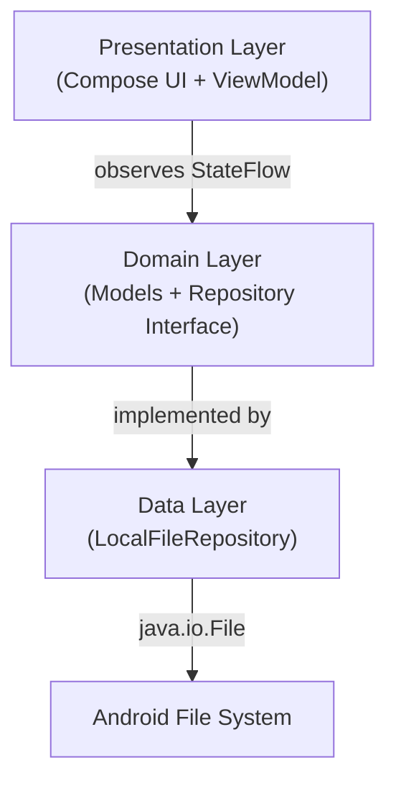

# Arcile - Developer Documentation

> Comprehensive documentation for developers working on Arcile.

**Version:** 0.3.0 | **Last Updated:** 2026-03-11
**Scope:** Internal Development, Security, and Style Specification

---

## Table of Contents

- [Architecture Overview](#architecture-overview)
- [Project Structure](#project-structure)
- [Naming Conventions](#naming-conventions)
- [UI & Design Guidelines](#ui--design-guidelines)
- [Configuration](#configuration)
- [Security Practices](#security-practices)
- [Error Handling](#error-handling)
- [Core Modules](#core-modules)
- [Testing](#testing)
- [Build & Deployment](#build--deployment)
- [Intended Changes](#intended-changes)
- [Project Auditing & Quality Standards](#project-auditing--quality-standards)
- [Troubleshooting](#troubleshooting)
- [Contributing](#contributing)

---

## Architecture Overview

Arcile follows a **Clean Architecture / MVVM** pattern with three layers:



### Key Design Decisions

| Decision | Rationale |
|----------|-----------|
| Single-module project | MVP simplicity — no multi-module overhead for an initial version |
| `StateFlow` over `LiveData` | Compose-native, null-safe, and better coroutine integration |
| `java.io.File` API directly | Simple and sufficient for local file operations at this stage |
| No DI framework | Avoiding Hilt/Koin complexity in MVP (ViewModel refactoring planned to resolve this) |
| `Stack` for path history | Simple LIFO navigation history (flagged for replacement with `ArrayDeque`) |
| Material 3 dynamic theming | Native Material You support on Android 12+ with manual fallback color schemes |

---

## Project Structure

```
arcile/
├── arcile-app/                             # Android project root (Gradle)
│   ├── app/
│   │   ├── src/main/
│   │   │   ├── AndroidManifest.xml         # Permissions, activity declaration
│   │   │   ├── java/dev/qtremors/arcile/
│   │   │   │   ├── ArcileApp.kt            # Application class (Coil image loader)
│   │   │   │   ├── MainActivity.kt         # Activity, permission flow, navigation shell
│   │   │   │   ├── data/
│   │   │   │   │   └── LocalFileRepository.kt   # Full file system implementation
│   │   │   │   ├── domain/
│   │   │   │   │   ├── FileModel.kt        # Core file data class
│   │   │   │   │   ├── FileRepository.kt   # Repository interface (all operations)
│   │   │   │   │   ├── FileCategories.kt   # Category definitions & MIME mappings
│   │   │   │   │   ├── SearchFilters.kt    # Filter criteria for file search
│   │   │   │   │   ├── StorageInfo.kt      # Storage total/free byte model
│   │   │   │   │   └── TrashMetadata.kt    # Trash entry model (id, originalPath, time)
│   │   │   │   ├── image/
│   │   │   │   │   ├── ApkIconFetcher.kt   # Coil fetcher for APK file icons
│   │   │   │   │   └── AudioAlbumArtFetcher.kt  # Coil fetcher for audio album art
│   │   │   │   ├── navigation/
│   │   │   │   │   └── AppRoutes.kt        # Centralised route string constants
│   │   │   │   ├── presentation/
│   │   │   │   │   ├── FileManagerViewModel.kt  # Shared ViewModel + FileManagerState
│   │   │   │   │   ├── FilePresentation.kt      # Presentation-layer file model
│   │   │   │   │   ├── SearchFilters.kt         # Presentation search filter model
│   │   │   │   │   └── ui/
│   │   │   │   │       ├── ArcileAppShell.kt         # Nav host + bottom bar shell
│   │   │   │   │       ├── HomeScreen.kt             # Dashboard screen
│   │   │   │   │       ├── FileManagerScreen.kt      # File browser screen (985 lines)
│   │   │   │   │       ├── RecentFilesScreen.kt      # Recent files list screen
│   │   │   │   │       ├── SettingsScreen.kt         # Theme/accent settings screen
│   │   │   │   │       ├── StorageDashboardScreen.kt # Storage breakdown screen
│   │   │   │   │       ├── ToolsScreen.kt            # Tools grid screen
│   │   │   │   │       ├── TrashScreen.kt            # Trash management screen
│   │   │   │   │       └── components/
│   │   │   │   │           ├── ArcileTopBar.kt           # Reusable contextual top bar
│   │   │   │   │           ├── Breadcrumbs.kt            # Path breadcrumb bar
│   │   │   │   │           ├── FileListControls.kt       # Sort/filter/view-mode controls 
│   │   │   │   │           ├── GlobalSearchBar.kt        # App-wide search bar
│   │   │   │   │           ├── SearchFiltersBottomSheet.kt # Filter bottom sheet
│   │   │   │   │           ├── ToolCard.kt               # Tool grid card component
│   │   │   │   │           └── TopBarAction.kt           # Top bar action model
│   │   │   │   ├── ui/theme/
│   │   │   │   │   ├── CategoryColors.kt   # Per-category color mappings
│   │   │   │   │   ├── Color.kt            # Color constants + accent schemes
│   │   │   │   │   ├── Shape.kt            # Custom shape definitions (squircle)
│   │   │   │   │   ├── Theme.kt            # Compose theme entry point
│   │   │   │   │   ├── ThemePreferences.kt # DataStore-backed theme persistence
│   │   │   │   │   ├── ThemeState.kt       # ThemeMode, AccentColor enums
│   │   │   │   │   └── Type.kt             # Typography scale
│   │   │   │   └── utils/
│   │   │   │       ├── CategoryColors.kt   # Category-to-color utility
│   │   │   │       └── FormatUtils.kt      # File size / date formatting helpers
│   │   │   └── res/                        # Standard Android resources
│   │   ├── build.gradle.kts               # App-level build config
│   │   └── proguard-rules.pro             # ProGuard/R8 rules
│   ├── gradle/libs.versions.toml          # Version catalog
│   ├── build.gradle.kts                   # Project-level build config
│   └── settings.gradle.kts               # Module settings
├── README.md
├── DEVELOPMENT.md                         # This file
├── CHANGELOG.md
├── TASKS.md
└── LICENSE.md
```

---

## Naming Conventions

> Prioritize self-documenting names. The purpose of a file, function, or component should be clear from its name alone.

### Files & Directories

| Type | Convention | Good Example | Bad Example |
|------|-----------|--------------|-------------|
| **Screens** | `PascalCase` + `Screen` suffix | `HomeScreen.kt`, `FileManagerScreen.kt` | `Home.kt`, `Screen1.kt` |
| **Components** | `PascalCase` descriptive name | `ArcileTopBar.kt`, `Breadcrumbs.kt` | `Bar.kt`, `Component1.kt` |
| **ViewModels** | `PascalCase` + `ViewModel` suffix | `FileManagerViewModel.kt` | `VM.kt`, `Logic.kt` |
| **Models** | `PascalCase` + `Model` suffix (or plain) | `FileModel.kt`, `StorageInfo` | `Data.kt` |
| **Repositories** | `PascalCase` + `Repository` suffix | `LocalFileRepository.kt` | `Files.kt` |

### Functions & Methods

| Prefix | Purpose | Example |
|--------|---------|---------|
| `load` | Load data from a source | `loadDirectory()`, `loadHomeData()` |
| `navigate` | Navigation actions | `navigateToFolder()`, `navigateBack()` |
| `on` | Callback / event handler | `onNavigateBack()`, `onSettingsClick()` |
| `toggle` | Toggle boolean state | `toggleSelection()` |
| `clear` | Reset/clear state | `clearSelection()`, `clearError()` |
| `create` | Create a resource | `createFolder()`, `createDirectory()` |
| `delete` | Remove a resource | `deleteFile()`, `deleteSelectedFiles()` |
| `get` | Retrieve data | `getRecentFiles()`, `getStorageInfo()` |
| `format` | Data formatting | `formatFileSize()` |
| `check` / `is` | Boolean checks | `checkStoragePermission()`, `isDirectory` |

### Constants & Enums

| Type | Convention | Example |
|------|-----------|---------|
| **Enum classes** | `PascalCase` | `ThemeMode`, `AccentColor` |
| **Enum values** | `UPPER_SNAKE_CASE` | `ThemeMode.SYSTEM`, `AccentColor.DYNAMIC` |
| **Compose colors** | `PascalCase` | `Purple80`, `PurpleGrey40` |

---

## UI & Design Guidelines

### Material 3 Expressive

Arcile uses **Material 3 Expressive**, an evolution of the Material Design 3 system that focuses on more organic, fluid, and emotionally resonant interfaces. **Do not use outdated M3/M2 components when an expressive alternative exists.**

#### Key Principles

1. **Motion Physics:** Use spring-based animations instead of fixed-duration easing (`tween`). Jetpack Compose 1.7+ defaults to springs for many modifiers, but always explicitly prefer `spring()` for custom animations to create a bouncy, lively feel.
2. **Morphing & Fluidity:** Favor components that morph dynamically rather than static generic shapes. 
3. **Typography & Hierarchy:** Utilize the expanded typography scale and deeper dynamic color contrast to establish clear visual hierarchy.

#### Implementation Requirements

- **Dependency:** Ensure `androidx.compose.material3:material3` is using a recent version that supports expressive components (e.g., `1.4.0-alpha` or newer).
- **Opt-In:** Expressive APIs are currently marked as experimental. Use the `@OptIn(ExperimentalMaterial3ExpressiveApi::class)` annotation on your composables or files.

#### Preferred Components

| Legacy/Standard Version | M3 Expressive Alternative | Use Case |
|-------------------|---------------------------|----------|
| `CircularProgressIndicator` | `LoadingIndicator` / `ContainedLoadingIndicator` | Loading states. Morphs through playful shapes instead of just spinning. |
| Standard `Button` | `SplitButton` | When a main action consistently needs a secondary dropdown/overflow action. |
| Standard `Row` of buttons | `ButtonGroup` | Grouping related, flexible actions dynamically. |
| Standard List Items | Expressive List Items | Segmented/interactive styling for lists (`OneLineListItem`, etc.). |

**Example Usage:**

```kotlin
@OptIn(ExperimentalMaterial3ExpressiveApi::class)
@Composable
fun ExpressiveLoading() {
    LoadingIndicator() // Use this instead of CircularProgressIndicator
}
```

---

## Configuration

### Build Configuration

| Setting | Value | File |
|---------|-------|------|
| `namespace` | `dev.qtremors.arcile` | `app/build.gradle.kts` |
| `applicationId` | `dev.qtremors.arcile` | `app/build.gradle.kts` |
| `compileSdk` | 36 (minor API level 1) | `app/build.gradle.kts` |
| `minSdk` | 24 | `app/build.gradle.kts` |
| `targetSdk` | 36 | `app/build.gradle.kts` |
| `versionCode` | 1 | `app/build.gradle.kts` |
| `versionName` | `1.0` | `app/build.gradle.kts` |

### Permissions

| Permission | Purpose | Scope |
|------------|---------|-------|
| `READ_EXTERNAL_STORAGE` | Read files on storage | Pre-Android 11 |
| `WRITE_EXTERNAL_STORAGE` | Write files on storage | Pre-Android 10 (`maxSdkVersion=29`) |
| `MANAGE_EXTERNAL_STORAGE` | Full file access | Android 11+ |

### Theme Configuration

| Setting | Default | Options |
|---------|---------|---------|
| Theme Mode | `SYSTEM` | `SYSTEM`, `LIGHT`, `DARK`, `OLED` |
| Accent Color | `DYNAMIC` | `DYNAMIC`, `MONOCHROME`, `BLUE`, `CYAN`, `GREEN`, `RED`, `PURPLE` |

---

## Security Practices

### File System Access

- All file operations go through the `FileRepository` interface
- Operations use `Result<T>` return types for safe error propagation
- File existence is validated before delete/rename operations

### Known Security Gaps (from audit)

> See [TASKS.md](TASKS.md) sections B1–B4 for details.

- No path traversal validation on file operations
- No input sanitization on folder/file names
- Release builds have minification disabled
- Backup configuration is default/permissive

### Reporting Vulnerabilities

If you discover a security vulnerability, please open a private issue or contact via email instead of opening a public issue.

---

## Error Handling

### ViewModel Layer

| Scenario | Strategy |
|----------|----------|
| **File operation failure** | `Result.onFailure` → update `FileManagerState.error` → `AlertDialog` shown to user |
| **Directory load failure** | Error message in state + history stack rollback |
| **Missing permission** | Blocking `PermissionRequestScreen` shown before app shell |

### Repository Layer

| Scenario | Strategy |
|----------|----------|
| **File not found** | `Result.failure(IllegalArgumentException)` |
| **Operation failed** | `Result.failure(Exception)` with descriptive message |
| **All IO operations** | Wrapped in `try/catch` on `Dispatchers.IO` |

---

## Core Modules

### FileRepository / LocalFileRepository

The data access layer for all file system operations.

**File operations:**

| Method | Description |
|--------|-------------|
| `listFiles(path)` | List and sort directory contents (folders first, alphabetical) |
| `createDirectory(parentPath, name)` | Create a new directory |
| `createFile(parentPath, name)` | Create a new empty file |
| `deleteFile(path)` | Delete a file or directory recursively |
| `renameFile(path, newName)` | Rename a file |
| `copyFiles(sourcePaths, destinationPath)` | Copy files to destination (overwrites) |
| `moveFiles(sourcePaths, destinationPath)` | Move files (atomic rename or copy+delete) |
| `getRootDirectory()` | Get external storage root |
| `getRecentFiles(limit, minTimestamp)` | Recent files via MediaStore |
| `getStorageInfo()` | Get total/free bytes via `StatFs` |
| `getCategoryStorageSizes()` | Per-category storage breakdown via MediaStore |
| `getFilesByCategory(categoryName)` | All files in a category via MediaStore |
| `searchFiles(query, pathScope, filters)` | MediaStore + filesystem search with filters |

**Trash subsystem:**

| Method | Description |
|--------|-------------|
| `moveToTrash(paths)` | Move files to `.arcile_trash/` with metadata |
| `restoreFromTrash(trashIds)` | Restore items to their original paths |
| `emptyTrash()` | Permanently delete all trash contents |
| `getTrashFiles()` | List all `TrashMetadata` entries |

### FileManagerViewModel

Shared ViewModel managing state for all current screens (home, explorer, trash, search, clipboard).

> **Note:** This is a planned refactor target — see [TASKS.md](TASKS.md) section D for context.

| Method | Description |
|--------|-------------|
| `loadHomeData()` | Fetch recent files and storage info |
| `navigateToHome()` | Reset to home screen state |
| `openFileBrowser()` | Switch to file browser at storage root |
| `navigateToFolder(path)` | Navigate to a directory with history tracking |
| `navigateBack()` | Pop history or return to home |
| `toggleSelection(path)` | Toggle file selection |
| `createFolder(name)` | Create folder in current directory |
| `deleteSelectedFiles()` | Move selected files to trash |
| `copySelectedFiles()` | Stage selected files for copy |
| `cutSelectedFiles()` | Stage selected files for move |
| `pasteFiles(destinationPath)` | Execute staged copy or move |
| `shareSelectedFiles()` | Launch Android share intent for selection |
| `searchFiles(query)` | Run a file search against the repository |

### Navigation

All route strings are centralised in `AppRoutes` in the `navigation/` package:

| Constant | Route |
|----------|-------|
| `HOME` | `"home"` |
| `EXPLORER` | `"explorer"` |
| `TOOLS` | `"tools"` |
| `SETTINGS` | `"settings"` |
| `TRASH` | `"trash"` |
| `RECENT_FILES` | `"recent_files"` |
| `STORAGE_DASHBOARD` | `"storage_dashboard"` |

### Image Loading

Coil image loading is configured in `ArcileApp` (Application class) with two custom `Fetcher` implementations:

| Fetcher | Source | Result |
|---------|--------|---------|
| `ApkIconFetcher` | `.apk` file path | Extracts the app icon via `PackageManager` |
| `AudioAlbumArtFetcher` | Audio file path | Extracts album art via `MediaMetadataRetriever` |

---

## Testing

### Running Tests

```bash
# All unit tests
./gradlew test

# Specific module tests
./gradlew :app:testDebugUnitTest

# Instrumented tests (requires device/emulator)
./gradlew connectedAndroidTest

# With coverage
./gradlew testDebugUnitTestCoverage
```

### Test Naming

```
fun methodUnderTest_scenario_expectedResult()
```

Examples:
```kotlin
fun navigateToFolder_updatesStateAndHistory()
fun deleteFile_fileDoesNotExist_returnsFailure()
fun formatFileSize_zeroBytes_returnsZeroB()
```

### What to Test

| Layer | Focus |
|-------|-------|
| **Unit** | ViewModel state transitions, `formatFileSize()`, path logic |
| **Integration** | `LocalFileRepository` with real file system |
| **UI** | Compose tests for screens and components |

### Current Coverage

| Category | Status |
|----------|--------|
| Unit tests | ❌ Not implemented |
| Integration tests | ❌ Not implemented |
| UI / Compose tests | ❌ Not implemented |

---

## Build & Deployment

### Debug Build

```bash
./gradlew assembleDebug
```
For standard builds:
APK output: `app/build/outputs/apk/debug/Arcile-dev.qtremors.arcile-0.3.0.apk`

> **Note:** The output filename is controlled by the `androidComponents` block in `app/build.gradle.kts`, which uses `VariantOutputImpl` (an internal AGP API) to inject the app ID and version into the filename. This is a known anomaly — see [TASKS.md](TASKS.md) general anomalies section for details.

### Release Build

```bash
./gradlew assembleRelease
```

> **Note:** Release signing is not configured yet. You will need to create a keystore and configure `signingConfigs` in `build.gradle.kts`.

### Release Checklist

- [ ] Enable `isMinifyEnabled = true` in release build type
- [ ] Enable `isShrinkResources = true`
- [ ] Configure ProGuard/R8 rules for app-specific needs
- [ ] Set up release signing configuration
- [ ] Bump `versionCode` and `versionName`
- [ ] Test on multiple API levels (24, 29, 30, 33, 36)
- [ ] Verify permissions flow on Android 11+ and pre-11

---

## Intended Changes

> Documented design anomalies. This section logs deliberate decisions or structural choices that might appear unconventional or incorrect at first glance, preventing accidental "fixes."

| Component / Feature | Deliberate Weirdness | Rationalization |
|---------------------|----------------------|-----------------|
| `compileSdk` block syntax | Uses `release(36) { minorApiLevel = 1 }` instead of `compileSdk = 36` | Required for AGP 9.x structured SDK versioning |
| `requestLegacyExternalStorage` in manifest | Deprecated attribute | Still needed for Android 10 (API 29) backward compatibility |
| Single ViewModel for all screens | Unusual for multi-screen apps | Intentional MVP simplification; refactoring planned (see TASKS.md D) |
| `VariantOutputImpl` cast in `androidComponents` | Internal AGP API | No stable public API for `outputFileName` exists yet in AGP 9.x — see TASKS.md anomalies |
| `.arcile_trash/` on shared external storage | Trash not using app-private storage | Allows files to survive app uninstall and inspections; trade-off documented in TASKS.md B |

### Technical Debt

- [ ] Implement dependency injection (Hilt or Koin)
- [ ] Remove `java.io.File` from domain `FileModel`
- [ ] Split `FileManagerViewModel` into per-screen ViewModels
- [ ] Persist theme preferences with DataStore
- [ ] Add proper path traversal validation
- [ ] Replace `java.util.Stack` with `ArrayDeque`
- [ ] Add comprehensive test suite

---

## Project Auditing & Quality Standards

> A structured approach to ensuring the project is correct, secure, and maintainable.

### System Understanding

Before making significant changes, ensure a deep understanding of:
- **Core Architecture**: Workflows, data flow, and overall purpose.
- **Implicit Design**: Underlying assumptions, dependencies, and hidden coupling.
- **Edge Cases**: Unintended behaviors, failure modes, and alternative use cases.

### Audit Categories

Evaluate changes and existing code against these dimensions:

| Category | Focus Areas |
|----------|-------------|
| **Correctness** | Logical errors, edge-case failures, silent failures, data integrity |
| **Security** | Vulnerabilities, permission flaws, input weaknesses, data exposure |
| **Performance** | Algorithm efficiency, file I/O optimization, memory/CPU usage |
| **Architecture** | Bottlenecks, tight coupling, structural mismatches, scalability |
| **Maintainability** | Readability, naming consistency, technical debt, dead code |
| **Documentation** | Accuracy, completeness, implementation-spec matching |
| **Configuration** | Build config, ProGuard rules, permission management |

### Reporting Process

- All audit findings must be added to [TASKS.md](TASKS.md).
- Ensure entries are **Clear**, **Actionable**, and **Concisely described**.
- Avoid ambiguity; provide specific context, steps to reproduce, and potential impact.

---

## Troubleshooting

### Common Issues

| Issue | Solution |
|-------|----------|
| **App shows blank screen** | Storage permission not granted — check app permissions in Settings |
| **`MANAGE_EXTERNAL_STORAGE` permission denied** | Must be granted via system Settings → Apps → Special Access → All Files Access |
| **Build fails with SDK version error** | Ensure Android SDK 36 is installed via SDK Manager |
| **`compileSdk` syntax error** | Requires AGP 9.x — check `agp` version in `libs.versions.toml` |
| **Files not updating after changes** | Call `viewModel.refresh()` or check `onResume` lifecycle |

### Debug Mode

```bash
# Run with verbose Gradle output
./gradlew assembleDebug --info

# Check for dependency conflicts
./gradlew :app:dependencies
```

---

## Contributing

### Commit Messages

Follow **Conventional Commits** format:

```
type(scope): short description

optional body
```

| Type | Purpose |
|------|---------|
| `feat` | New feature |
| `fix` | Bug fix |
| `docs` | Documentation only |
| `refactor` | Code change that neither fixes a bug nor adds a feature |
| `test` | Adding or updating tests |
| `chore` | Build, CI, tooling changes |

### Branch Naming

```
type/short-description
```

Examples: `feature/add-file-search`, `fix/permission-state-desync`, `docs/update-readme`

### Code Style

- Follow [Kotlin Coding Conventions](https://kotlinlang.org/docs/coding-conventions.html)
- Use trailing commas in multi-line parameter lists
- Prefer expression-body functions for single-expression returns
- Use `@Composable` functions with `PascalCase` names
- Compose previews should use `@Preview` annotation with meaningful parameters

### Pull Request Process

1. Create a branch from `main`
2. Implement your changes, adhering to the project's style and conventions
3. Run tests (`./gradlew test`)
4. Build successfully (`./gradlew assembleDebug`)
5. Commit with clear messages
6. Open a Pull Request with:
   - [ ] Description of what changed and why
   - [ ] Screenshots (if UI changes)
   - [ ] Test evidence
   - [ ] Related TASKS.md item reference

---

<p align="center">
  <a href="README.md">← Back to README</a>
</p>
