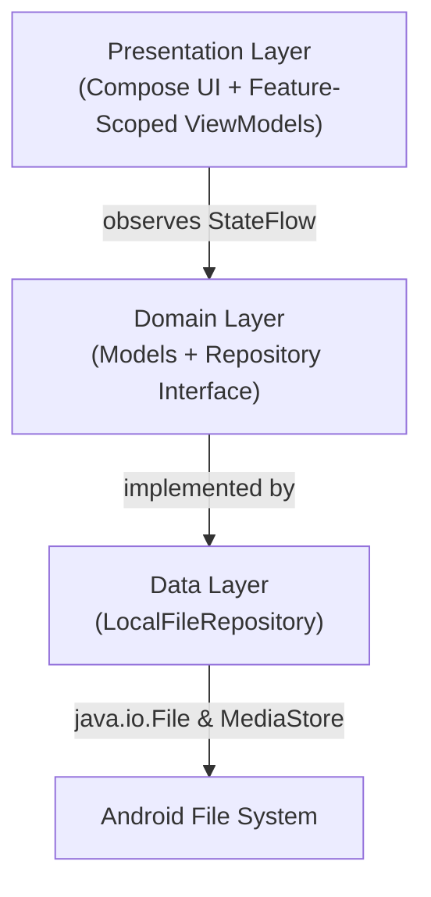

# Arcile - Developer Documentation

> Comprehensive documentation for developers working on Arcile.

**Version:** 0.5.3 | **Last Updated:** 2026-03-27
**Scope:** Internal Development, Security, Architecture, UI Paradigms, and Style Specification

---

## Table of Contents

- [Architecture Overview](#architecture-overview)
- [Project Structure](#project-structure)
- [Core Concepts & Implementations](#core-concepts--implementations)
- [Navigation & State Management](#navigation--state-management)
- [Storage System & Trash](#storage-system--trash)
- [Core Modules & ViewModels](#core-modules--viewmodels)
- [UI & Design Paradigms](#ui--design-paradigms)
- [Naming Conventions](#naming-conventions)
- [Configuration](#configuration)
- [Security Practices](#security-practices)
- [Error Handling](#error-handling)
- [Testing](#testing)
- [Build & Deployment](#build--deployment)
- [Intended Changes & Anomalies](#intended-changes--anomalies)
- [Project Auditing & Quality Standards](#project-auditing--quality-standards)
- [Troubleshooting](#troubleshooting)
- [Contributing](#contributing)

---

## Architecture Overview

Arcile is a **single-module MVVM** app with domain/data separation, Kotlin Coroutines, and Flow-backed state:



### Key Design Decisions

| Decision | Rationale |
|----------|-----------|
| **Single-module project** | Keeps the project simple while features are still evolving, with package boundaries used instead of Gradle modules. |
| **`StateFlow` over `LiveData`** | Compose-native, null-safe, and deeply integrated with coroutines. Each ViewModel exposes a single unified state (e.g., `BrowserState`). |
| **Hilt Dependency Injection** | Manages repositories, the foreground bulk-operation coordinator, and feature ViewModels through `RepositoryModule`. |
| **Hybrid I/O Approach** | Direct `java.io.File` APIs for fast local operations + optimized `MediaStore` SQL queries for device-wide indexing and category sizes. |
| **Type-Safe Navigation** | Jetpack Compose Navigation via `kotlinx.serialization` entirely removes string-based route fragility. |
| **Material 3 Expressive** | Native Material You support, customized dynamic themes via `MaterialKolor`, and advanced spring physics. |

---

## Project Structure

A detailed map of the project to help you locate domain logic, UI components, and data implementations instantly.

```text
arcile/
├── arcile-app/                             # Android project root (Gradle)
│   ├── app/
│   │   ├── src/
│   │   │   ├── main/
│   │   │   │   ├── AndroidManifest.xml     # Permissions, activity declaration
│   │   │   │   ├── java/dev/qtremors/arcile/
│   │   │   │   │   ├── ArcileApp.kt        # Application class (Coil config, Hilt app)
│   │   │   │   │   ├── MainActivity.kt     # Single Activity, theme resolution, Nav Host setup
│   │   │   │   │   ├── data/               # Data Layer (Implementations)
│   │   │   │   │   │   ├── BrowserPreferencesRepository.kt
│   │   │   │   │   │   ├── LocalFileRepository.kt
│   │   │   │   │   │   ├── StorageClassificationRepository.kt
│   │   │   │   │   │   ├── manager/
│   │   │   │   │   │   │   └── TrashManager.kt
│   │   │   │   │   │   ├── provider/
│   │   │   │   │   │   │   └── VolumeProvider.kt
│   │   │   │   │   │   └── source/
│   │   │   │   │   │       ├── FileSystemDataSource.kt
│   │   │   │   │   │       └── MediaStoreClient.kt
│   │   │   │   │   ├── di/                 # Dependency Injection
│   │   │   │   │   │   └── RepositoryModule.kt
│   │   │   │   │   ├── domain/             # Domain Layer (Interfaces & Models)
│   │   │   │   │   │   ├── BrowserPreferences.kt
│   │   │   │   │   │   ├── ConflictModels.kt
│   │   │   │   │   │   ├── DeletePolicy.kt
│   │   │   │   │   │   ├── FileCategories.kt
│   │   │   │   │   │   ├── FileModel.kt
│   │   │   │   │   │   ├── FileRepository.kt
│   │   │   │   │   │   ├── SearchFilters.kt
│   │   │   │   │   │   ├── StorageBrowserLocation.kt
│   │   │   │   │   │   ├── StorageInfo.kt
│   │   │   │   │   │   ├── StorageScope.kt
│   │   │   │   │   │   ├── TrashMetadata.kt
│   │   │   │   │   │   └── usecase/
│   │   │   │   │   │       ├── GetStorageVolumesUseCase.kt
│   │   │   │   │   │       ├── MoveToTrashUseCase.kt
│   │   │   │   │   │       └── PasteFilesUseCase.kt
│   │   │   │   │   ├── image/              # Coil Fetchers
│   │   │   │   │   │   ├── ApkIconFetcher.kt
│   │   │   │   │   │   └── AudioAlbumArtFetcher.kt
│   │   │   │   │   ├── navigation/         # Type-safe serialization routes
│   │   │   │   │   │   └── AppRoutes.kt
│   │   │   │   │   ├── presentation/       # Presentation Layer (ViewModels & UI)
│   │   │   │   │   │   ├── browser/        # BrowserViewModel & delegates
│   │   │   │   │   │   ├── home/           # HomeViewModel & state
│   │   │   │   │   │   ├── recentfiles/    # RecentFilesViewModel & state
│   │   │   │   │   │   ├── settings/       # SettingsViewModel & state
│   │   │   │   │   │   ├── trash/          # TrashViewModel & state
│   │   │   │   │   │   └── ui/             # Compose Screens & Components
│   │   │   │   │   └── utils/              # Cross-layer utilities
│   │   │   │   └── res/                    # Localized strings, drawables, fonts
│   │   │   ├── test/                       # JVM + Robolectric test suite
│   │   │   │   ├── data/                   # Storage/routing/classification tests
│   │   │   │   ├── domain/                 # Domain model and policy tests
│   │   │   │   ├── presentation/           # ViewModel and Compose component tests
│   │   │   │   ├── utils/                  # Utility tests
│   │   │   │   └── testutil/               # Shared test rules and theme wrappers
│   │   │   └── androidTest/                # Instrumented tests (device/emulator)
│   │   │       └── ui/                     # Screen-level integration tests
│   │   └── build.gradle.kts               # App-level config
│   ├── gradle/libs.versions.toml          # Centralized dependency catalog
│   ├── build.gradle.kts                   # Project-level config
│   └── settings.gradle.kts                # Module settings
├── docs/                                   # Public-facing website (GitHub Pages)
│   ├── index.html                         # Landing page
│   ├── styles.css                         # Custom styles
│   └── scripts.js                         # Interactive behavior
├── README.md
├── DEVELOPMENT.md                         # This file
├── CHANGELOG.md
├── PRIVACY.md                             # Privacy policy
└── TASKS.md                               # Audit findings & to-dos
```

---

## Core Concepts & Implementations

### Smart Paste & Conflict Resolution
File collisions during copy/move operations are natively handled by a complex "Smart Paste" engine inside `LocalFileRepository.kt` and `BrowserViewModel.kt`:
1. **Detection:** Before pasting, `detectCopyConflicts` checks only top-level source-vs-destination collisions so large directory pastes stay responsive.
2. **Resolution UI:** A step-by-step conflict dialog allows users to choose "Replace", "Keep Both", or "Skip", with a batch-processing "Do this for all" checkbox.
3. **Auto-Renaming:** Resolving via "Keep Both" uses the shared production `FileConflictNameGenerator` helper to create stable suffixed names (for example, `document (1).txt`).
4. **Background Execution:** Once conflicts are resolved, copy and move operations are handed off to a foreground-service pipeline so they are less likely to be interrupted when the app backgrounds.

### Unified Deletion Policy Engine
Deletion is dynamically routed based on the current context (`DeletePolicy` in domain):
- When deleting files on a permanent drive (Internal/SD), the items are routed to the **Trash Bin**.
- When deleting files on a temporary drive (OTG), the app automatically enforces **Permanent Deletion** and updates the warning dialog accordingly.
- The UI surfaces a "Unified Deletion Dialog" that automatically checks/disables a "Permanently Delete" checkbox depending on the underlying drive's capability.

### Performance Caching & MediaStore Optimizations
To prevent UI freezes, Arcile utilizes several performance layers:
- **MediaStore Cache TTL:** Category-size analytics remain cached for 5 minutes in `MediaStoreClient` to avoid repeated expensive scans.
- **Explicit Volume Refresh:** Storage volume `StatFs` snapshots are refreshed via `VolumeProvider.invalidateCache()` after app-owned file mutations instead of waiting for mount broadcasts alone. 
- **Database-Level Category Search:** Searching within specific categories (like "Images") natively filters at the `MediaStore` SQL level rather than pulling all files into memory and filtering them via Kotlin.
- **Micro-delayed Loading Guards:** To prevent the UI from "flickering" a loading spinner when data is loaded from a fast cache, a 5ms synchronous micro-delay is implemented across ViewModels before broadcasting an `isLoading = true` state.

---

## Navigation & State Management

### Type-Safe Navigation
Arcile uses Jetpack Compose Navigation combined with `kotlinx.serialization`. Instead of passing raw strings, navigation targets are strongly-typed data classes and objects defined in `AppRoutes.kt`. This completely eliminates route-parsing bugs.

### ViewModel State & Process Death
ViewModels (like `BrowserViewModel`) are heavily decoupled to manage specific feature states. 
- **`StateFlow`:** UI strictly observes state emissions. Synchronous loading state transitions eliminate UI flickering.
- **`SavedStateHandle`:** Navigation history and current directory paths are written to the `SavedStateHandle`. If Android kills the app in the background to reclaim memory (Process Death), the user will return to their exact folder context seamlessly.
- **Instance Sharing:** `StorageDashboardScreen` shares the existing `HomeViewModel` tied to the Home back stack. Other navigation flows should not assume that behavior automatically; shared-state gaps are tracked in `TASKS.md`.

---

## Storage System & Trash

### The `StorageScope` Engine
`StorageScope` is a sealed class that dictates the logical bounds of repository queries (like recent files, sizes, and searches).
- `AllStorage`: Scans every mounted volume.
- `Volume(volumeId)`: Constrains queries to a specific drive (e.g., SD Card).
- `Path(path, volumeId)`: Limits operations to a specific folder.
- `Category(volumeId, categoryName)`: Maps queries to specific file extensions across a volume.

### External Storage Classification
Arcile natively differentiates between permanent and temporary external media:
1. **Internal Storage / SD Cards:** Classified as *Permanent*. Fully supports indexing, caching, and the Trash Bin.
2. **USB OTG / Unclassified:** Classified as *Temporary*. Files on these drives are explicitly excluded from the global Storage Dashboard and Recent Files to prevent UI clutter. **Deletions on OTG drives are permanent.**

### Custom Trash Implementation
Because Scoped Storage severely limits cross-app deletion mechanisms, Arcile implements a custom bypass:
- **Location:** `.arcile/.trash` and `.arcile/.metadata` hidden folders generated at the root of every *Permanent* volume.
- **Metadata:** When trashed, a JSON metadata file tracks the original path, timestamp, and volume ID.
- **Fallback Restoration:** If an SD Card is removed, and the user attempts to restore a trashed file from it, Arcile catches the missing volume and prompts the user with a `DestinationRequiredException` fallback destination picker.

---

## Core Modules & ViewModels

### FileRepository / LocalFileRepository
The single source of truth for file operations. It is now a facade delegating to `VolumeProvider`, `TrashManager`, `MediaStoreClient`, and `FileSystemDataSource`.

| Method Context | Description |
|----------------|-------------|
| **Storage Info** | `observeStorageVolumes()`, `getStorageVolumes()`, `getVolumeForPath()`, `getStorageInfo()`, `getCategoryStorageSizes()` |
| **Media Queries**| `getRecentFiles()`, `getFilesByCategory()`, `searchFiles()` |
| **File Ops**     | `listFiles()`, `createDirectory()`, `createFile()`, `deleteFile()`, `deletePermanently()`, `renameFile()`, `copyFiles()`, `moveFiles()` |
| **Trash**        | `moveToTrash()`, `restoreFromTrash()`, `emptyTrash()`, `getTrashFiles()` |

### Feature-Scoped ViewModels
ViewModels manage state and logic tailored to specific application features, reducing coupling and improving testability.

| ViewModel | Responsibility |
|-----------|----------------|
| `BrowserViewModel` | Core file exploration logic, search, selection, clipboard staging, and delete handling. Uses `NavigationDelegate`, `ClipboardDelegate`, `SearchDelegate`, and `DeleteFlowDelegate`; bulk copy/move execution is delegated to a foreground-operation coordinator. |
| `HomeViewModel` | Dashboard state, including quick-access categories, recent file previews, and scoped storage overview. |
| `RecentFilesViewModel` | Manages the full list of recently modified files, scoped to volumes, enabling direct actions, timeline sorting, and shared delete-flow behavior through `DeleteFlowDelegate`. |
| `TrashViewModel` | Dedicated logic for browsing the recycle bin, permanent deletion, and metadata-aware restoration. |

### Background File Operations
Long-running copy and move requests are no longer executed directly inside `viewModelScope`. The browser delegates conflict preflight work to the UI layer, then hands the final operation to `BulkFileOperationCoordinator`, which starts `BulkFileOperationService` as a foreground service and emits completion or failure events back to the ViewModel.

### Image Loading
Coil image loading is configured in `ArcileApp` with custom `Fetcher` implementations:
- `ApkIconFetcher`: Extracts the app icon via `PackageManager` from `.apk` files.
- `AudioAlbumArtFetcher`: Extracts album art via `MediaMetadataRetriever` from audio files.

---

## UI & Design Paradigms

### Material 3 Expressive
Arcile's interface is built on the cutting-edge **Material 3 Expressive** guidelines.
- **Motion Physics:** Uses `spring()` over linear `tween()` animations to give cards and lists a bouncy, fluid feel.
- **Morphing Fab:** The `ExpandableFabMenu` natively morphs its shape radius from an expressive squircle (16dp) to a perfect circle (28dp) when expanding its internal `ExtendedFloatingActionButton` options.
- **Dynamic Colors:** `MaterialKolor` dynamically extracts visually compliant color palettes from user-selected accent themes (e.g., Cyan, Monochrome, OLED Dark).
- **Internationalization (i18n):** Most shared UI strings are extracted to `res/values/strings.xml`, but some production hardcoded strings still remain and are tracked in `TASKS.md`. New UI text should always use string resources.

### Key UX Paradigms
When adding new UI features, strictly adhere to these established paradigms:
- **Hidden System Files:** Any file or directory starting with a dot (`.`) must have its visual opacity lowered to `50%` to clearly indicate it is a hidden system element.
- **Transition Content Keys:** When animating between folder layers in `FileManagerScreen`, always map the animation to the `FileManagerContentKey` data class. Do not rely on primitive string concatenation, as it causes animation collisions during rapid navigation.
- **Scroll Position Resetting:** Changing the active sorting order in a directory must actively reset the `LazyColumn` scroll state to `0`, preventing users from getting lost in large lists.
- **Aspect Ratio Locking:** Image previews inside `FileGridItem` must use an edge-to-edge layout and lock their container to exactly a `1:1` aspect ratio to prevent grid fragmentation.
- **Contextual Search Bars:** Search bars should utilize dynamic placeholders reflecting the current `StorageScope` (e.g., displaying "Search images..." when inside the Images category).

### Preferred Components

| Legacy/Standard Version | M3 Expressive Alternative | Use Case |
|-------------------|---------------------------|----------|
| `CircularProgressIndicator` | `LoadingIndicator` / `ContainedLoadingIndicator` | Loading states. Morphs through playful shapes instead of just spinning. |
| Standard `Button` | `SplitButton` | When a main action consistently needs a secondary dropdown/overflow action. |
| Standard `Row` of buttons | `ButtonGroup` | Grouping related, flexible actions dynamically. |
| Standard List Items | Expressive List Items | Segmented/interactive styling for lists (`OneLineListItem`, etc.). |

---

## Naming Conventions

> Prioritize self-documenting names. The purpose of a file, function, or component should be clear from its name alone.

### Files & Directories

| Type | Convention | Good Example | Bad Example |
|------|-----------|--------------|-------------|
| **Screens** | `PascalCase` + `Screen` suffix | `HomeScreen.kt`, `FileManagerScreen.kt` | `Home.kt`, `Screen1.kt` |
| **Components** | `PascalCase` descriptive name | `ArcileTopBar.kt`, `Breadcrumbs.kt` | `Bar.kt`, `Component1.kt` |
| **ViewModels** | `PascalCase` + `ViewModel` suffix | `BrowserViewModel.kt` | `BrowserLogic.kt` |
| **Models** | `PascalCase` + `Model` suffix (or plain) | `FileModel.kt`, `StorageInfo` | `Data.kt` |
| **Repositories** | `PascalCase` + `Repository` suffix | `LocalFileRepository.kt` | `Files.kt` |

### Functions & Methods

| Prefix | Purpose | Example |
|--------|---------|---------|
| `load` | Load data from a source | `loadDirectory()`, `loadHomeData()` |
| `navigate` | Navigation actions | `navigateToFolder()`, `navigateBack()` |
| `on` | Callback / event handler | `onNavigateBack()`, `onSettingsClick()` |
| `toggle` | Toggle boolean state | `toggleSelection()` |
| `clear` | Reset/clear state | `clearSelection()`, `clearError()` |
| `create` | Create a resource | `createFolder()`, `createDirectory()` |
| `delete` | Remove a resource | `deleteFile()`, `deleteSelectedFiles()` |
| `get` | Retrieve data | `getRecentFiles()`, `getStorageInfo()` |
| `format` | Data formatting | `formatFileSize()` |
| `check` / `is` | Boolean checks | `checkStoragePermission()`, `isDirectory` |

### Constants & Enums

| Type | Convention | Example |
|------|-----------|---------|
| **Enum classes** | `PascalCase` | `ThemeMode`, `AccentColor` |
| **Enum values** | `UPPER_SNAKE_CASE` | `ThemeMode.SYSTEM`, `AccentColor.DYNAMIC` |
| **Compose colors** | `PascalCase` | `Purple80`, `PurpleGrey40` |

---

## Configuration

### Build Configuration

| Setting | Value | File |
|---------|-------|------|
| `namespace` | `dev.qtremors.arcile` | `app/build.gradle.kts` |
| `applicationId` | `dev.qtremors.arcile` | `app/build.gradle.kts` |
| `compileSdk` | 36 | `app/build.gradle.kts` |
| `minSdk` | 30 (Android 11.0) | `app/build.gradle.kts` |
| `targetSdk` | 36 | `app/build.gradle.kts` |
| `unitTests.isIncludeAndroidResources` | `true` | `app/build.gradle.kts` |

### Permissions

| Permission | Purpose | Scope |
|------------|---------|-------|
| `MANAGE_EXTERNAL_STORAGE` | Full file access for browsing, copying, moving, and deleting files | Android 11+ (API 30+) — required |
| `READ_EXTERNAL_STORAGE` | Legacy read access — declared in manifest but unused at runtime | Declared without `maxSdkVersion`; effectively inert since `minSdk=30` |
| `WRITE_EXTERNAL_STORAGE` | Legacy write access | Declared with `maxSdkVersion="29"`; never activated since `minSdk=30` |

> **Note: Android 11+ Only**
> Arcile requires Android 11 (API 30) or later. The app relies on `java.io.File` for maximum I/O speed together with the `MANAGE_EXTERNAL_STORAGE` permission for unrestricted filesystem access. Earlier Android versions are not supported.

### Theme Configuration

| Setting | Default | Options |
|---------|---------|---------|
| Theme Mode | `SYSTEM` | `SYSTEM`, `LIGHT`, `DARK`, `OLED` |
| Accent Color | `DYNAMIC` | `DYNAMIC`, `MONOCHROME`, `BLUE`, `CYAN`, `GREEN`, `RED`, `PURPLE` |

---

## Security Practices

1. **Path Traversal Protection:** `validateFileName` middleware aggressively screens all file creations and renames for `../` escapes and null bytes.
2. **FileProvider Exposure:** `file_provider_paths.xml` intentionally covers broad external roots so arbitrary user files can be opened and shared; changes here should be reviewed carefully because they affect both compatibility and URI exposure.
3. **Trash Indexing:** `.nomedia` files are automatically forced into the Trash directories so deleted photos don't accidentally appear in other Gallery apps.
4. **Error Masking:** Network and disk I/O crashes are written to Android Logcat natively rather than silently dropped, but explicit path directories are masked from logs to protect user privacy.

---

## Error Handling

### Coroutine Exception Contract
When catching exceptions inside Coroutines or Flow blocks, you **must not** swallow `CancellationException`. Doing so breaks structured concurrency and prevents jobs from terminating cleanly when scopes are canceled.
- **Bad:** `catch (e: Exception) { Log.e(TAG, "Error", e) }`
- **Good:** `catch (e: Exception) { if (e is CancellationException) throw e; Log.e(TAG, "Error", e) }`
- **Alternative:** Use `runCatching { ... }.onFailure { if (it is CancellationException) throw it }`

### ViewModel Layer

| Scenario | Strategy |
|----------|----------|
| **File operation failure** | `Result.onFailure` binds errors to state variables and foreground bulk-operation completion events. Errors should be surfaced through screen state without relying on release log output. |
| **Directory load failure** | Error message in state + history stack rollback. |
| **Missing permission** | Blocking `PermissionRequestScreen` shown before app shell. |

### Repository Layer

| Scenario | Strategy |
|----------|----------|
| **File not found** | `Result.failure(IllegalArgumentException)` |
| **Operation failed** | `Result.failure(Exception)` with descriptive custom exceptions like `DestinationRequiredException` for business logic flow routing. |
| **All IO operations** | Wrapped in `try/catch` on `Dispatchers.IO` |

---

## Testing

Arcile maintains a layered JVM test suite with **55 test cases across 22 files**, covering domain logic, data-layer business rules, ViewModel state machines, and Robolectric-backed Compose component tests.

### Current Coverage Snapshot

| Layer | Coverage | Test Files |
|-------|----------|------------|
| **Domain** | `DeletePolicy`, `FileModel`, `StorageInfo`, `StorageKind` | 3 files, 10 tests |
| **Data (Business Rules)** | Scope matching, classification merging, storage filtering, trash routing, unique filename generation | 6 files, 18 tests |
| **Utilities** | `FormatUtils`, `CategoryColors` | 2 files, 6 tests |
| **ViewModels** | `HomeViewModel`, `BrowserViewModel`, `RecentFilesViewModel`, `TrashViewModel`, `StorageScopeViewModel`, `FilePresentation` | 6 files, 30 tests |
| **UI Components** | `DeleteConfirmationDialog`, `ArcileTopBar`, `EmptyState` (Robolectric + Compose UI) | 3 files, 6 tests |
| **Instrumented** | `HomeScreen` rendering, `EmptyState` rendering | 3 files, 3 tests |

### JVM Test Setup
- Pure unit and coroutine tests live under `app/src/test` and run with `testDebugUnitTest`.
- Robolectric is enabled for JVM Compose component tests.
- `unitTests.isIncludeAndroidResources = true` is required so Robolectric-backed Compose tests can resolve app resources.
- Shared test helpers include `MainDispatcherRule` (coroutine dispatcher override) and `ArcileTestTheme` (Compose theme wrapper).

### Running Tests
```bash
# All JVM tests
./gradlew :app:testDebugUnitTest

# Full unit test task alias
./gradlew testDebugUnitTest

# Instrumented tests (requires device/emulator)
./gradlew connectedAndroidTest
```

### Compose / Robolectric Notes
- Current Robolectric-backed Compose tests are pinned to SDK 35 using `@Config(sdk = [35])` because the project compiles against SDK 36 while Robolectric support can lag behind preview/new platform levels.
- For reusable Compose components, prefer Robolectric-backed `src/test` coverage first; use `androidTest` only when device/runtime behavior is essential.
- Wrap tested composables in `ArcileTestTheme` so typography, shapes, colors, and composition locals match production defaults.

### Remaining Coverage Gaps
- **Data Layer:** `FileSystemDataSource`, `TrashManager`, `MediaStoreClient`, and `LocalFileRepository` have no test coverage. These contain all destructive file operations and are the highest-priority gap.
- **ViewModels:** `SettingsViewModel` is untested. `NavigationDelegate` history stack edge cases need coverage.
- **UI Components:** Most dialogs, list components, and all full screens beyond `HomeScreen` lack test coverage.
- **Navigation:** No end-to-end navigation integration tests exist.

### Test Naming
```kotlin
fun methodUnderTest_scenario_expectedResult()
```
Examples:
```kotlin
fun navigateToFolder_updatesStateAndHistory()
fun deleteFile_fileDoesNotExist_returnsFailure()
fun overflowMenu_dispatchesGridViewAction()
```

---

## Build & Deployment

### Debug Build
```bash
./gradlew assembleDebug
```
APK output: `app/build/outputs/apk/debug/Arcile-dev.qtremors.arcile.debug-{versionName}-debug.apk`

### Release Build
```bash
./gradlew assembleRelease
```
*Note: Release builds enforce `isMinifyEnabled = true` (R8 ProGuard) and require local keystore properties configured in `local.properties`.*

---

## Intended Changes & Anomalies

> Documented design anomalies to prevent accidental "fixes."

| Component / Feature | Deliberate Weirdness | Rationalization |
|---------------------|----------------------|-----------------|
| `VariantOutputImpl` | Internal AGP API used in `androidComponents` block | This is a known build-tool workaround and remains a maintenance risk tracked in `TASKS.md`. |
| Shared `.trash` storage | Trash lives on public roots rather than app-private `/data/` storage | Preserves trashed files across app uninstall, but it also carries privacy/security tradeoffs that remain under audit in `TASKS.md`. |
| Robolectric Compose SDK pin | UI tests use `@Config(sdk = [35])` instead of tracking `compileSdk` directly | Keeps JVM UI tests stable while the app targets a newer SDK level than Robolectric fully supports. |

---

## Project Auditing & Quality Standards

### System Understanding
Before making significant changes, ensure a deep understanding of:
- **Core Architecture:** Workflows, data flow, and overall purpose.
- **Implicit Design:** Underlying assumptions, dependencies, and hidden coupling.
- **Edge Cases:** Unintended behaviors, failure modes, and alternative use cases.

### Audit Categories
Evaluate changes and existing code against these dimensions:

| Category | Focus Areas |
|----------|-------------|
| **Correctness** | Logical errors, edge-case failures, silent failures, data integrity |
| **Security** | Vulnerabilities, permission flaws, input weaknesses, data exposure |
| **Performance** | Algorithm efficiency, file I/O optimization, memory/CPU usage |
| **Architecture** | Bottlenecks, tight coupling, structural mismatches, scalability |

Audit findings should be logged directly into `TASKS.md` using the structured template, and completed release work should be reflected in both `TASKS.md` and `CHANGELOG.md` during version bumps.

---

## Troubleshooting

### Common Issues

| Issue | Solution |
|-------|----------|
| **App shows blank screen** | Storage permission not granted — check app permissions in Settings |
| **`MANAGE_EXTERNAL_STORAGE` permission denied** | Must be granted via system Settings → Apps → Special Access → All Files Access |       
| **Build fails with SDK version error** | Ensure Android SDK 36 is installed via SDK Manager |
| **Robolectric UI tests fail on unsupported SDK** | Keep JVM Compose tests pinned with `@Config(sdk = [35])` until Robolectric fully supports the newer compile SDK |
| **Files not updating after changes** | Call `viewModel.refresh()` or check `onResume` lifecycle |

### Debug Mode
```bash
# Run with verbose Gradle output
./gradlew assembleDebug --info

# Check for dependency conflicts
./gradlew :app:dependencies
```

---

## Contributing

### Commit Messages
Follow **Conventional Commits**:
```text
type(scope): short description

optional body
```
| Type | Purpose |
|------|---------|
| `feat` | New feature |
| `fix` | Bug fix |
| `docs` | Documentation only |
| `refactor` | Code change that neither fixes a bug nor adds a feature |
| `test` | Adding or updating tests |
| `chore` | Build, CI, tooling changes |

### Branch Naming
```text
type/short-description
```
Examples: `feature/add-file-search`, `fix/permission-state-desync`

### Code Style
- Follow [Kotlin Coding Conventions](https://kotlinlang.org/docs/coding-conventions.html)
- Use trailing commas in multi-line parameter lists
- Prefer expression-body functions for single-expression returns
- Use `@Composable` functions with `PascalCase` names
- Compose previews should use `@Preview` annotation with meaningful parameters

### Process
1. Create a branch from `main`.
2. Implement your changes, adhering to the project's style and conventions.
3. Run tests (`./gradlew test`).
4. Build successfully (`./gradlew assembleDebug`).
5. Submit PR with visual screenshots if UI changes were made.

---

<p align="center">
  <a href="README.md">← Back to README</a>
</p>
