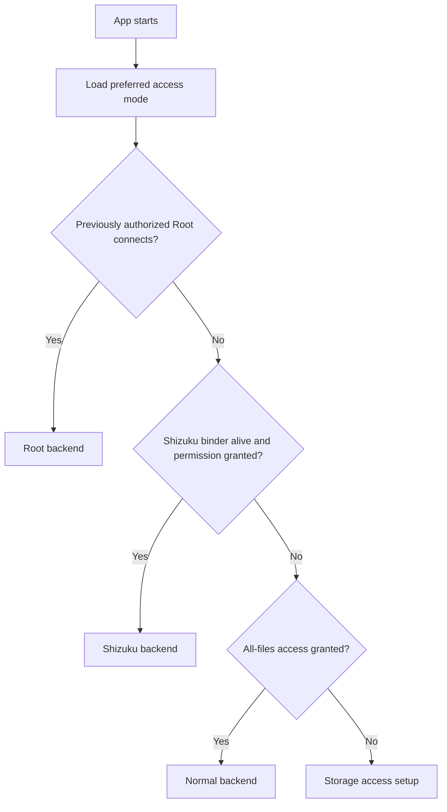

# Root and Shizuku Support Implementation Plan

## Objective

Add capability-aware storage access with four persisted modes:

- **Automatic**: prefer Root, then Shizuku, then Normal Android access.
- **Root**: use a root service and remain in an actionable failed state if it is unavailable.
- **Shizuku**: use a Shizuku UserService and remain in an actionable failed state if it is unavailable.
- **Normal**: retain the existing Android APIs, MediaStore, SAF, and all-files-access behavior.

The selected mode and active backend are separate. Automatic mode may remain selected while Normal is active because Root is unavailable or Shizuku has stopped.

Automatic mode must only use previously authorized backends. It must not unexpectedly trigger a Root or Shizuku permission request during application startup.



The remote service's actual UID determines its privilege level:

- UID `0`: Root capabilities.
- UID `2000`: ADB shell capabilities.
- Any unexpected UID: reject the connection.

## User Access Model

| Backend | Effective identity | Expected access |
| --- | --- | --- |
| Root | UID 0 | Most mounted filesystems and protected data, subject to encryption, mount state, SELinux, and the root manager |
| Shizuku started through ADB | UID 2000 | Locations and platform operations available to `adb shell`, subject to Android version, OEM policy, Unix permissions, and SELinux |
| Shizuku/Sui started as Root | UID 0 | Root capabilities while retaining Shizuku as the connection transport |
| Normal Android | Arcile application UID | Shared storage through Android APIs, MediaStore, SAF, and `MANAGE_EXTERNAL_STORAGE` |

Root access does not imply that every path is safe or writable. System partitions may remain read-only, credential-encrypted data remains unavailable before device unlock, and virtual filesystems contain non-file resources that must not be treated like ordinary files.

Arcile will not expose arbitrary shell execution, partition remounting, SELinux modification, or unrestricted system filesystem writes.

## 1. Add Privilege Modules

Add the following modules:

```text
core/privilege/api
core/privilege/android
```

Update:

- `arcile-app/settings.gradle.kts`
- `arcile-app/gradle/libs.versions.toml`
- `arcile-app/app/build.gradle.kts`
- `arcile-app/app/src/main/AndroidManifest.xml`

Add version-catalog entries for:

- Shizuku API and provider.
- libsu core and service.
- Supporting coroutine and Hilt dependencies where required.

Do not bump the application version as part of this work unless separately requested.

### `core:privilege:api`

Own stable access and filesystem contracts:

- `PrivilegeMode`
- `PrivilegeBackendId`
- `PrivilegeState`
- `PrivilegeServiceIdentity`
- `PrivilegeCapability`
- `PrivilegeFailure`
- `PrivilegeCoordinator`
- `PrivilegePreferences`
- `PrivilegedFileClient`
- `PrivilegedFileEntry`
- `PrivilegedFileHandle`
- `PrivilegedOperationProgress`

Connection state must distinguish:

- Unavailable.
- Installed but stopped.
- Permission required.
- Permission denied.
- Connecting.
- Ready.
- Disconnected.
- Incompatible.
- Failed.

### `core:privilege:android`

Own all Android-specific behavior:

- Preference persistence.
- Backend detection and selection.
- Root connection and service lifecycle.
- Shizuku connection and service lifecycle.
- AIDL definitions.
- Remote filesystem implementation.
- Binder death handling.
- Hilt providers.
- Privileged content-provider integration.

Feature modules may depend on `core:privilege:api`. They must not import libsu, Shizuku, Binder, or the Android implementation module directly.

## 2. Define a Typed Remote Filesystem Protocol

Use one AIDL filesystem service shared by Root and Shizuku.

Required operations:

- Protocol handshake.
- Service identity and effective UID.
- Capability query.
- Canonicalize and `lstat`.
- Paged directory listing.
- Filesystem statistics.
- Create file.
- Create directory.
- Open for reading.
- Open for writing.
- Rename.
- Copy.
- Move.
- Delete.
- Recursive delete.
- Secure overwrite where supported.
- Update timestamps.
- Operation cancellation.
- Progress callbacks.

The handshake must return:

- Protocol version.
- Effective UID and PID.
- Connection transport.
- SELinux context when available.
- Supported capabilities.
- Maximum directory-listing page size.

Use `ParcelFileDescriptor` for content. Never send complete file contents or unbounded directory results through Binder.

Directory results must be paged, with a bounded page size such as 100-250 entries, to stay below Binder transaction limits.

Define typed remote failures:

- Access denied.
- Path missing.
- Path already exists.
- Read-only filesystem.
- Unsupported file type.
- Backend disconnected.
- Operation interrupted.
- Invalid path.
- Insufficient storage.
- General I/O failure.

Do not expose a generic command-execution method.

## 3. Implement the Root Backend

Add:

- `ArcileRootFileService : RootService`
- `RootBackendConnector`
- Shared `PrivilegedFileServiceBinder`
- Shared `PrivilegedFileEngine`

Behavior:

1. Perform a passive Root availability check without prompting.
2. Request Root only after explicit user action or when reconnecting a previously authorized explicit Root mode.
3. Bind a non-daemon libsu RootService.
4. Perform the protocol and UID handshake.
5. Reject the connection unless the effective UID is `0`.
6. Keep the service bound while operations or open handles require it.
7. Unbind when Arcile no longer needs it.
8. Report denial, timeout, revocation, and service death separately.

Do not create a persistent boot daemon.

## 4. Implement the Shizuku Backend

Add:

- `ArcileShizukuFileService`
- `ShizukuBackendConnector`
- Injectable facade around Shizuku static APIs.
- Binder and permission event flows.

Behavior:

- Detect a Shizuku manager through its declared permission rather than assuming one package name.
- Observe binder-received and binder-dead events.
- Require a live `pingBinder()` result before trusting cached permission state.
- Request permission only after explicit user action.
- Verify the supported Shizuku API level.
- Bind a non-daemon UserService.
- Perform handshake Binder calls off the main callback thread.
- Apply a bounded connection timeout.
- Always unbind in `finally`.
- Wait briefly for actual disconnection before a quick rebind.
- Close and recreate the connection after unexpected binder death.

A Shizuku UserService running as UID `2000` receives shell capabilities. A Shizuku or Sui service running as UID `0` receives Root capabilities. The UI should show the difference clearly.

## 5. Implement the Privilege Coordinator

`DefaultPrivilegeCoordinator` owns the single source of truth for:

- Preferred mode.
- Available backends.
- Active backend.
- Connection generation.
- Effective service identity.
- Capabilities.
- Last failure.

Automatic selection order:

1. Previously authorized and connectable Root.
2. Live and previously authorized Shizuku.
3. Normal Android storage access.
4. Setup required.

Explicit Root or Shizuku mode must not silently fall back after failure. It should display the failure and offer an explicit **Use Normal** action.

Each operation must capture one backend-session generation. Changing the active backend cannot redirect the middle of an operation to a different backend.

Read-only operations may reconnect and retry once when safe. Mutations must never silently retry because that can duplicate or partially replay work.

## 6. Integrate with Arcile's Storage Identity

Arcile's existing `StorageNodeRef` already contains `backendId`, `canonicalIdentity`, `capabilities`, and `backendIdentity`. Add stable backend IDs for:

- `root`
- `shizuku`

Add privileged `StorageNodeRef` factories that use canonical identities supplied by the remote service. Do not resolve protected canonical paths with local `java.io.File` calls from Arcile's application process.

Populate `StorageNodeCapabilities` from both:

- Operations allowed by the connected service.
- Arcile's product safety policy.

Examples:

- Shell-readable but non-writable path: readable only.
- Protected Root path with advanced writes disabled: readable but not mutable.
- Virtual special file: no archive, share, edit, or destructive operations.
- System partition: read-only.

Persist backend identity anywhere a storage reference is retained, including relevant recent-file, snapshot, search, and restoration state. If the backend is unavailable later, present the item as unavailable instead of treating it as a missing local file.

## 7. Add a Backend-Aware Filesystem Data Source

Keep `FileSystemDataSource` as the storage repository seam and introduce:

```text
BackendAwareFileSystemDataSource
 ├── LocalFileSystemDataSource
 └── PrivilegedFileSystemDataSource
```

Route operations using `StorageNodeRef.backendId` or a captured active backend for new browser destinations.

Migrate:

- `DefaultFileBrowserRepository`
- `DefaultFileMutationRepository`
- Clipboard operations.
- Volume repository.
- Save-destination browsing.
- Directory-list paging.
- File property loading.

Normal local and MediaStore behavior must remain unchanged.

## 8. Make Path Safety Capability-Aware

The existing path policy is correct for Normal mode but intentionally restricts mutations to known shared-storage roots. Replace the single rule with explicit scopes:

- `USER_STORAGE`
- `ANDROID_APP_STORAGE`
- `APP_PRIVATE_DATA`
- `SYSTEM_READ_ONLY`
- `VIRTUAL_FILESYSTEM`
- `UNSUPPORTED`

Default policy:

| Scope | Read | Write |
| --- | --- | --- |
| User storage | Yes | Yes |
| Android app storage | When the active backend permits | When the active backend permits |
| Other applications' private data | Root only | Advanced opt-in |
| System partitions | Root only | No |
| `/proc`, `/sys`, `/dev` | Limited | No |
| Arcile internal and vault areas | Existing dedicated rules | Existing dedicated rules |

Recursive operations must:

- Use `lstat` and preserve symbolic-link identity.
- Never follow symbolic links during destructive recursion.
- Reject NUL characters and traversal attempts.
- Validate source and destination independently.
- Protect filesystem and storage roots from recursive deletion.
- Reject devices, sockets, and FIFOs unless a specific operation supports them.
- Retain Arcile's existing trash and vault boundaries.

The first implementation will not support partition remounting, chmod/chown UI, SELinux modification, or system partition writes.

## 9. Migrate Complete Storage Workflows

Privileged directory listing is not sufficient. Every operation that consumes a listed entry must support backend-aware access.

### Core mutations

Migrate:

- File and directory creation.
- Rename and batch rename.
- Conflict detection.
- Copy and move.
- Permanent deletion.
- Shred.
- Trash and restore.
- Mutation finalization.
- Mutation journal.
- Folder statistics.
- Properties scanning.

When both endpoints use the same privileged backend, run copy and move inside the privileged service. For cross-backend transfers, stream through file descriptors.

Use recognizable temporary names for partial outputs and publish completed output with an atomic rename when supported.

### Archives

Refactor archive managers to depend on backend-aware input/output abstractions rather than directly opening `File`:

- ZIP.
- TAR.
- 7z.
- Archive metadata.
- Conflict detection.
- Extraction.
- Archive creation.

Archive libraries may remain in Arcile's process while reading and writing through privileged file descriptors.

### Cleaner and storage usage

Migrate:

- Storage-cleaner traversal.
- Large-file scanning.
- Duplicate and content sampling.
- Storage-usage trees.
- Root storage analysis.

Protected areas must never be scanned automatically. The user must explicitly choose the scope.

### Search and indexing

Retain MediaStore search for normal home categories. Add filesystem search for the current privileged directory or an explicitly selected scope.

Do not recursively index all of `/data` by default.

## 10. Support Previews, Playback, Editing, and Handoffs

Add a tokenized privileged content provider.

Each token record contains:

- Opaque random ID.
- Backend ID.
- Canonical storage identity.
- Requested access mode.
- Display name and MIME type.
- Expiration time.
- Expected consumer UID where it can be determined safely.

The content URI must contain only the opaque token, never a privileged path.

Use this provider for:

- Coil image loading.
- Image viewer.
- Video playback.
- Audio playback.
- PDF rendering and printing.
- APK inspection.
- Metadata extraction.
- Thumbnails.
- Open-with.
- External sharing.

Preserve the current staging implementation for vault plaintext handoffs and compatibility cases. External privileged handoffs remain read-only.

Text editing must use privileged descriptors and an atomic save flow:

1. Open the source for reading.
2. Write to a temporary sibling through the same backend.
3. Flush, sync, and close.
4. Replace the original with a privileged rename.
5. Preserve the original when saving fails.

## 11. Replace the Global All-Files Permission Gate

Replace the current `Environment.isExternalStorageManager()` application gate with an access-readiness model:

- `Ready(activeBackend)`
- `SetupRequired`
- `Connecting`
- `Failed`

Arcile may enter the application when Root or Shizuku is ready even without `MANAGE_EXTERNAL_STORAGE`.

On activity resume:

- Refresh Normal all-files permission.
- Refresh Root authorization state.
- Re-check Shizuku binder and permission.
- Reconnect only when necessary.
- Preserve browser tabs, current paths, selection, playback, and scroll state.

If a backend disappears:

- Keep the current browser location.
- Show an inline access-lost state.
- Offer **Reconnect** and **Use Normal**.
- Navigate to an accessible ancestor or roots only after explicit fallback.

## 12. Add Onboarding and Settings UX

### Onboarding

Replace the single storage-permission requirement with a Storage Access step offering:

- Automatic.
- Root.
- Shizuku.
- Normal Android.

Root states:

- Available.
- Permission required.
- Connected.
- Denied.
- Unavailable.

Shizuku states:

- Not installed.
- Installed but stopped.
- Permission required.
- Connected as shell.
- Connected as Root.
- Incompatible.

Normal states:

- All-files access granted.
- Grant access.

The user can always choose Normal without installing Shizuku.

### Settings

Add an access-provider section showing:

- Preferred mode.
- Active backend.
- Effective privilege.
- Connection status.
- Reconnect action.
- Permission action.
- Open Shizuku manager action.
- Use Normal action.
- Protected-filesystem writes toggle.
- Concise accessible-scope explanation.

Switching backend should refresh open locations without restarting Arcile.

## 13. Handle Failures and Interrupted Work

Map privileged failures into Arcile's existing typed errors and presentation mapping.

Required feedback includes:

- Root permission was denied.
- Shizuku is not running.
- Shizuku permission is required.
- The privileged service stopped during the operation.
- This path is readable but cannot be changed with Shizuku.
- The filesystem is read-only.
- This system location is protected by Arcile.

For interrupted mutations:

- Cancel outstanding callbacks.
- Close descriptors.
- Refresh source and destination.
- Inspect known temporary outputs.
- Report completed and failed items accurately.
- Offer an explicit retry.
- Never silently replay the operation.

## 14. Test the Backends and User Journeys

### Unit tests

Add coverage for:

- Automatic selection priority.
- Explicit-mode failure behavior.
- Root denial and revocation.
- Shizuku stopped, denied, and binder-dead states.
- Stale Shizuku permission with a dead binder.
- UID-to-capability mapping.
- Connection timeout.
- Binder death and reconnect.
- Cancellation and guaranteed unbind.
- Operation-generation isolation.
- Privileged `StorageNodeRef` mapping.
- Remote error mapping.
- Path scopes.
- Symbolic-link-safe recursion.
- Content-token expiry and path secrecy.

Use injectable facades around libsu and Shizuku static APIs.

### Backend contract tests

Run the same filesystem behavior suite against:

- Local backend.
- In-process privileged fake.
- Root service on a test device.
- Shizuku service on a test device.

Cover:

- Unicode and newline-containing filenames.
- Large directories.
- Files larger than 4 GB.
- Random-access reads.
- Cross-directory moves.
- Partial-copy cancellation.
- Read-only paths.
- Broken symbolic links.
- Special files.
- Insufficient-storage failures.
- Service death during listing, reading, writing, and moving.

### UI tests

Cover:

- Onboarding backend selection.
- Permission results.
- Settings status.
- Reconnect.
- Explicit fallback.
- Protected-write warnings.
- Access loss while browsing.
- State restoration after reconnect.

### Device matrix

Validate at minimum on:

- Android 11 / API 30.
- A current supported Android release.
- A rooted Magisk or KernelSU device.
- A non-root device with Shizuku started through ADB or wireless debugging.
- Shizuku running with Root, when available.

Normal-mode regression testing remains mandatory.

## 15. Enforce Security and Architecture Boundaries

Add architecture tests preventing:

- Shizuku or libsu imports outside `core:privilege:android`.
- Raw `Runtime.exec` or arbitrary shell execution outside the connector implementation.
- Feature composables performing privileged filesystem I/O.
- External providers accepting raw filesystem paths.
- Recursive privileged mutations without scope validation.
- Presentation code depending on Binder or `ParcelFileDescriptor` types.

Do not log:

- File contents.
- Root shell output.
- Authentication details.
- External-provider tokens.

Activity history may retain user-visible paths as it currently does, but failures must not dump full privileged process or security-context data.

## 16. Implementation and Commit Sequence

The work will exceed the repository's large-diff threshold. Keep it recoverable with coherent sequential commits:

1. Add privilege API, dependencies, state model, and preferences.
2. Add Root and Shizuku service connections.
3. Route browser and core mutations through storage backends.
4. Migrate properties, archives, trash, cleaner, search, and usage.
5. Add privileged descriptors, previews, viewers, editors, and sharing.
6. Add onboarding, Settings, recovery, and safety UI.
7. Complete tests, architecture enforcement, cleanup, and changelog.

Use the required `v1.9.0: <summary>` commit format unless a version bump is explicitly requested.

Before updating `CHANGELOG.md`, inspect recent entries and the complete diff. Document only completed and verified user-visible outcomes.

Run expensive Gradle builds serially.

## Acceptance Criteria

The implementation is complete only when:

- Root users can browse and operate on protected locations allowed by Arcile's safety policy without all-files permission.
- Shizuku users can browse and operate on locations permitted to UID `2000`, with accurate access-denied feedback elsewhere.
- Shizuku running as Root is detected correctly.
- Normal Android behavior remains unchanged.
- Privileged files work in previews, playback, properties, archives, editing, sharing, cleaner, search, trash, and storage-usage views.
- Binder death never leaves an indefinite loading state.
- Mutations are never silently replayed after disconnection.
- Switching or reconnecting preserves browser context.
- No arbitrary shell interface is introduced.
- System and virtual filesystem writes remain blocked.
- Focused tests, the complete unit-test suite, and serial Gradle builds pass.
- The final diff and changelog are reviewed.

## Out of Scope

- Remounting system partitions.
- Modifying SELinux policy or enforcement.
- System application management.
- Boot-time privileged daemons.
- Arbitrary terminal commands.
- Bypassing device encryption.
- Unrestricted chmod/chown or virtual-filesystem writes.
