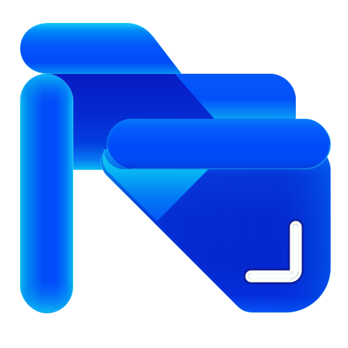

<p align="center">
  
</p>

<h1 align="center"><a href="https://qtremors.github.io/arcile/">Arcile</a></h1>

<p align="center">
  A Private & Modern Android file manager.
</p>

<p align="center">
  
  
  
  
  
</p>

> [!NOTE]
> **Privacy Model** Arcile does not request `android.permission.INTERNET`.

---

## Why Arcile

Arcile is built for people who want a fast Android file manager without ads, trackers, telemetry, or internet access.

It supports internal storage, SD cards, USB drives, encrypted OnlyFiles vaults, Trash, recent files, native image and video viewing, archive workflows, and storage insights.

---

## Features

| Feature | Description |
|---------|-------------|
| **Multi-Volume File Browser** | Browse and manage internal storage, SD cards, and USB drives. |
| **Home Dashboard** | Storage summaries, category shortcuts, pinned folders, and recent files. |
| **Storage Dashboard** | Capacity-aware usage rings distinguish accessible files, system data, and free space, with cached folder drill-down and a synchronized grouped list. |
| **Quick Access** | Pin local folders, custom folders, and external handoff targets such as Android/data and Android/obb. |
| **Recent Files** | Browse recent files with grouping, search, filters, thumbnails, selection, properties, and containing-folder jumps. |
| **Gallery & Media Viewers** | Browse photo and video albums, then use Arcile's native image and video viewers with sibling paging, thumbnail navigation, favorites, sharing, and file actions. |
| **OnlyFiles Vaults** | Create app-private or portable encrypted vaults with paged browsing, protected media previews, biometric convenience unlock, health checks, and guarded import, export, share, and open workflows. |
| **Storage Cleaner** | Review large files, exact duplicates, APKs, downloads, videos, marker files, empty folders, ignored items, and conservative cache cleanup. |
| **Archive Workflows** | Create ZIP, 7z, and TAR-family archives; browse and extract supported archive formats; handle password-protected ZIP/7z files; and block unsafe extraction paths. |
| **Foreground File Operations** | Copy, move, archive, extract, Trash, and delete flows show foreground progress and operation recovery prompts where available. |
| **Conflict Resolution** | Smart paste detects top-level name collisions, compares metadata for conflicting files, and supports replace, keep both, skip, and batch resolution choices. |
| **Trash Subsystem** | Preview trashed media, restore individual items with confirmation, inspect properties, and safely recover payloads whose original metadata is unavailable; temporary drives delete permanently. |
| **Selection Properties** | Inspect selected files and folders with paths, counts, sizes, hidden-item counts, file types, and access status. |
| **Search & Filters** | Search and filter by type, size, date, extension, hidden files, volume, folder scope, and saved presets. |
| **Material 3 Theming** | Dynamic colors, custom accents, light/dark/OLED modes, haptics, filename controls, and thumbnail controls. |
| **First-Run Onboarding** | Guided setup for theme, accent, all-files access, and notification permission context for long-running operations. |
| **Open / Share Handoff** | Opens and shares files through a centralized helper with path checks, staging for shared local files, batch guards, MIME grouping, and Android content URI handoff. |
| **Offline & Ad-Free** | No internet permission, no ads, no telemetry, and no tracker dependency. |

---

## Supported File Types

Arcile can browse and manage files of any type, including files with unknown or missing extensions. Copy, move, rename, share, properties, Trash, search, and Open With are not limited to the formats below.

| Category | Recognized extensions | Arcile behavior |
|---------|------------------------|-----------------|
| **Images** | `.jpg`, `.jpeg`, `.png`, `.gif`, `.bmp`, `.webp`, `.svg`, `.heic`, `.heif`, `.ico`, `.raw` | Gallery, thumbnails, built-in image viewer, gestures, and metadata inspection. HEIC, HEIF, ICO, and RAW decoding depends on Android/device codec support. Metadata writing is available for writable `.jpg`, `.jpeg`, `.png`, and `.webp` files. |
| **Videos** | `.mp4`, `.mkv`, `.avi`, `.mov`, `.wmv`, `.flv`, `.webm`, `.m4v`, `.3gp`, `.3g2`, `.ts`, `.mts`, `.m2ts`, `.mpeg`, `.mpg`, `.vob`, `.ogv` | Video galleries, thumbnails, and native playback with seeking, tracks, subtitles, speed, repeat, resize, sibling paging, sharing, and file actions. Codec support varies by device. |
| **Audio** | `.mp3`, `.wav`, `.flac`, `.aac`, `.ogg`, `.wma`, `.m4a`, `.opus`, `.amr`, `.mid`, `.midi` | Album-art previews, categorization, file operations, sharing, and playback through a compatible installed app. |
| **Documents** | `.pdf`, `.doc`, `.docx`, `.xls`, `.xlsx`, `.ppt`, `.pptx`, `.txt`, `.rtf`, `.odt`, `.ods`, `.odp`, `.csv`, `.epub` | Categorization, search, properties, file operations, sharing, and opening through a compatible installed app. |
| **Archives — browse and extract** | `.zip`, `.7z`, `.tar`, `.tar.gz`, `.tgz`, `.tar.bz2`, `.tbz2`, `.tar.xz`, `.txz`, `.gz`, `.bz2`, `.xz` | Built-in archive browsing and extraction. Password-protected archive handling is available for ZIP and 7z. |
| **Archives — create** | `.zip`, `.7z`, `.tar`, `.tar.gz`, `.tgz`, `.tar.bz2`, `.tbz2`, `.tar.xz`, `.txz` | Built-in archive creation with selectable compression options. |
| **Other recognized archives** | `.rar`, `.zst` | Recognized as archives for categorization and normal file management; use Open With for an installed compatible app. |
| **Android packages** | `.apk`, `.xapk`, `.apks`, `.apkm` | Package icons, categorization, file operations, sharing, and Android-compatible handoff. Installation support depends on the package type and installed system/app handlers. |
| **3D models** | `.glb` | Recognized as model files for categorization, file operations, sharing, and Open With through a compatible installed Android app. |

Actual playback, decoding, preview, and external opening capabilities can vary by Android version, device codecs, and installed apps.

---

## Quick Start

Download the latest APK from [GitHub Releases](https://github.com/qtremors/arcile/releases) and install it on your Android device.

> **Runtime permission:** Arcile requires Android 11 or newer and uses Android's all-files access permission for full file management. Notification permission is requested on newer Android versions so foreground file operations can show progress.

### Build Commands

Run Gradle commands from `arcile-app/` (`gradlew.bat` may be used instead of `./gradlew` on Windows):

```bash
# Build the debug APK
./gradlew :app:assembleDebug

# Run the plugin-system and app integration unit tests
./gradlew :plugin-api:testDebugUnitTest :core:plugin:android:testDebugUnitTest :feature:plugins:testDebugUnitTest :app:testDebugUnitTest

# Build the signed, minified release APK
./gradlew :app:assembleRelease
```

Release outputs:

```text
app/build/outputs/apk/release/Arcile-1.6.0.apk
```

Install the Arcile APK with:

```bash
adb install -r app/build/outputs/apk/debug/Arcile-1.6.0-debug.apk
```

Arcile retains its versioned plugin discovery and handoff system for separately distributed compatible plugins; no viewer plugin APK is bundled in this repository. Compatible Arcile plugins must be signed with the same certificate as Arcile.

### Release Signing

Release builds read signing credentials from `signing.properties` first, then `local.properties` as a fallback. Neither file should be committed.

```properties
signing.storeFile=/absolute/path/to/my-release-key.jks
signing.storePassword=your_store_password
signing.keyAlias=your_key_alias
signing.keyPassword=your_key_password
```

From the Gradle root (`arcile-app/`), build the release APK:

```bash
./gradlew :app:assembleRelease
```

Release builds enable R8 minification and resource shrinking.

---

## Tech Stack

| Layer | Technology |
|-------|------------|
| **Language** | Kotlin 2.2.10 |
| **Android Gradle Plugin** | 9.2.1 |
| **UI** | Jetpack Compose BOM 2026.05.00, Material 3 1.5.0-alpha19, Material 3 Adaptive |
| **Architecture** | Modular MVVM with Gradle-enforced boundaries, feature-owned routes and ViewModels, StateFlow, and Hilt DI |
| **Navigation** | Navigation Compose with `kotlinx.serialization` typed routes |
| **Storage** | `java.io.File`, `StatFs`, MediaStore, encrypted vault storage, cache-backed FileProvider handoffs, foreground service operations |
| **Persistence** | Room cache database (`arcile-cache.db`, schema version 2) plus DataStore Preferences for theme, browser presentation, storage classification, quick access, cleaner rules, and onboarding |
| **Media** | Coil image pipelines and Media3 native video playback |
| **Archives** | Apache Commons Compress, Tukaani XZ, and Zip4j |
| **Android Support** | Android 11 or newer |

---

## Project Structure

```text
arcile/
├── arcile-app/
│   ├── build-logic/                             # Shared Gradle conventions and architecture checks
│   ├── app/                                     # Activities, Hilt composition, root shell, and route mapping
│   ├── core/
│   │   ├── navigation/api/                      # Serializable typed destinations
│   │   ├── operation/{api,android}/             # Operation contracts, journal, coordinator, and service
│   │   ├── plugin/android/                      # Generic plugin discovery and compatibility checks
│   │   ├── presentation/                        # Shared presentation controllers, reducers, and models
│   │   ├── runtime/                             # Dispatchers, logging, and runtime helpers
│   │   ├── storage/{domain,data}/               # Focused storage contracts and Android implementations
│   │   ├── vault/{domain,crypto,data}/           # OnlyFiles contracts, cryptography, and encrypted storage
│   │   ├── testing/                             # Shared unit-test fakes
│   │   └── ui/testing/                          # Design system plus Compose test support
│   ├── feature/                                 # Feature-owned routes, ViewModels, screens, and workflows
│   │   ├── activitylog/                         # Completed operation history
│   │   ├── archive/                             # Archive creation, browsing, and extraction
│   │   ├── browser/                             # File browsing, selection, clipboard, and file actions
│   │   ├── home/                                # Storage overview, categories, pins, and recent files
│   │   ├── imagegallery/                        # Photos, albums, viewer, favorites, and metadata
│   │   ├── import/                              # Save-to-Arcile share intake
│   │   ├── onboarding/                          # First-run setup and permission guidance
│   │   ├── onlyfiles/                           # Encrypted vault library, browser, and transfers
│   │   ├── plugins/                             # Generic compatible-plugin management UI
│   │   ├── quickaccess/                         # Pins and Android restricted-location handoffs
│   │   ├── recentfiles/                         # Recent-file timeline and filters
│   │   ├── settings/                            # Preferences, backup, and maintenance controls
│   │   ├── storagecleaner/                      # Cleanup scanning and review
│   │   ├── storageusage/                        # Storage dashboard and folder usage map
│   │   ├── trash/                               # Volume-scoped restore and permanent deletion
│   │   └── videoplayer/                         # Shared native video viewer
│   ├── plugin-api/                              # Versioned plugin intent and metadata contract
│   └── plugin-ui/                               # UI primitives for separately distributed plugins
├── docs/                                        # Promotional landing page website
├── beta/                                        # Beta phase archived changelog & releases
│   ├── CHANGELOG-BETA.md                        # Archived beta changelog
│   └── RELEASES-BETA.md                         # Archived beta release notes
├── CHANGELOG.md                                 # Stable release changelog
├── DEVELOPMENT.md                               # Architecture & development guide
├── Releases.md                                  # Stable user-facing release notes
├── TASKS.md                                     # Roadmap, tracker of issues and features
└── README.md                                    # Main entry point overview
```

---

## Testing

Run from the Gradle root (`arcile-app/`). Use the narrowest relevant task while iterating, then run the broader local gates for a release milestone:

```bash
# Test only an affected Android module while iterating
./gradlew :feature:browser:testDebugUnitTest

# All JVM and Android unit/Robolectric tests
./gradlew test testDebugUnitTest

# Release-oriented non-device verification
./gradlew :app:lintDebug checkProductionStrings :app:verifyArcileBuildConventions

# Architecture boundaries only
./gradlew :app:testDebugUnitTest --tests dev.qtremors.arcile.ArchitectureBoundaryTest

# Release Arcile
./gradlew :app:assembleRelease

# Device tests, only when an emulator or device is intentionally available
./gradlew :app:connectedDebugAndroidTest
```

Pure Kotlin/JVM modules use `test`; Android modules use `testDebugUnitTest`. Run architecture checks after changing dependencies, package ownership, public APIs, feature ViewModels, or production UI boundaries. Reserve complete unit/Robolectric and lint passes for release milestones.

Instrumented tests are a deliberate separate step and require an attached emulator or device. The complete suite includes JVM/Robolectric tests, Compose UI tests, instrumented Android tests, architecture checks, lint, and release convention checks.

---

## Documentation

| Document | Description |
|----------|-------------|
| [DEVELOPMENT.md](DEVELOPMENT.md) | Architecture, storage model, testing, conventions, and maintenance notes |
| [CHANGELOG.md](CHANGELOG.md) | Stable version history and release notes |
| [Releases.md](Releases.md) | Concise public release summaries |
| [arcile-app/docs/ONLYFILES_FORMAT_AND_SECURITY.md](arcile-app/docs/ONLYFILES_FORMAT_AND_SECURITY.md) | OnlyFiles format, security boundaries, recovery limits, and backup guidance |
| [beta/CHANGELOG-BETA.md](beta/CHANGELOG-BETA.md) | Archived version history from the beta phase |
| [beta/RELEASES-BETA.md](beta/RELEASES-BETA.md) | Archived release notes from the beta phase |
| [TASKS.md](TASKS.md) | Audit findings, planned features, and known issues |
| [PRIVACY.md](PRIVACY.md) | Privacy policy |
| [LICENSE.md](LICENSE.md) | License terms and attribution |

---

## License

**Tremors Source License (TSL)** - source-available license allowing viewing, forking, and derivative works with **mandatory attribution**. Commercial use requires written permission.

Web Version: [qtremors.github.io/license](https://qtremors.github.io/license)

See [LICENSE.md](LICENSE.md) for full terms.

---

<p align="center">
  Made by <a href="https://github.com/qtremors">Tremors</a>
</p>
