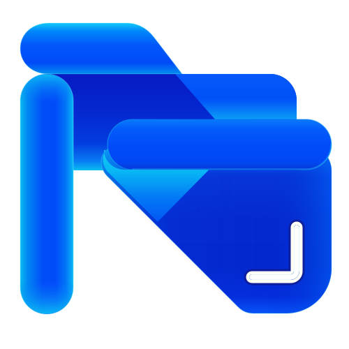

<p align="center">
  
</p>

<h1 align="center"><a href="https://qtremors.github.io/arcile/">Arcile</a></h1>

<p align="center">
  A private, modern Android file manager.
</p>

<p align="center">
  <a href="https://github.com/qtremors/arcile/releases/latest">
    
  </a>
</p>

<p align="center">
  <a href="https://github.com/qtremors/arcile/releases"></a>
  <a href="https://github.com/qtremors/arcile/releases"></a>
</p>

<p align="center">
  
  
  
  
</p>

> [!NOTE]
> **Privacy First:** Arcile does not request internet permissions (`android.permission.INTERNET`). Your files stay strictly on your device.

---

## Why Arcile

Arcile is an offline Android file manager built for speed, privacy, and clean design. Most file managers are packed with ads, background trackers, and unnecessary network permissions. Arcile has zero ads, no telemetry, and works completely offline.

---

## Features

### 📁 Storage & File Management
- **Multi-Volume Support**: Browse internal storage, SD cards, and USB OTG drives.
- **Storage Insights**: See what's taking up space with clear visual usage charts and folder breakdowns.
- **PowerRename**: Batch rename files with search & replace, regex, case formatting, presets, and instant undo.
- **File Operations**: Copy, move, zip, extract, and delete with progress tracking and collision handling.
- **Trash Bin**: Safely stage deleted items before permanently removing them.

### 🔒 Privacy & Vaults
- **Encrypted Vaults (OnlyFiles)**: Lock private files inside encrypted vaults with biometric authentication and protected media previews.
- **Fully Offline**: No internet access requested or needed.

### 🎬 Built-in Media
- **Image Gallery & Viewer**: Browse photo albums, view full-resolution images, inspect EXIF metadata, and manage favorites.
- **Video Player**: Built-in video playback with volume/brightness gestures, double-tap seek, and subtitle support.

### ⚡ Utilities
- **APK & Split Installer**: View package details and install standard `.apk` files and split packages (`.apks`, `.xapk`, `.apkm`).
- **Archives**: Create and extract ZIP, 7z, and TAR archives (including password-protected ZIP/7z files).
- **Storage Cleaner**: Quickly spot large files, duplicates, leftover cache, and empty folders.
- **Material 3 Interface**: Clean Material You layout with dynamic colors, OLED dark mode, and haptic feedback.

---

## File Format Support

Arcile manages all file types on your device, including unknown or custom extensions.

- **Built-in Tools**: Includes a native image viewer, video player, archive manager, and APK installer.
- **System Integration**: Open, edit, or share any format through installed Android apps.

---

## Quick Start

Download the latest APK from [GitHub Releases](https://github.com/qtremors/arcile/releases) and install it on your Android device.

> **Runtime permission:** Arcile requires Android 11 or newer and uses Android's all-files access permission for full file management. Notification permission is requested on newer Android versions so foreground file operations can show progress.

### Build Commands

Run Gradle commands from `arcile-app/` (`gradlew.bat` on Windows):

```bash
# Build debug APK
./gradlew :app:assembleDebug

# Run unit tests
./gradlew :app:testDebugUnitTest

# Release verification (lint, strings, build conventions)
./gradlew :app:lintDebug checkProductionStrings :app:verifyArcileBuildConventions

# Build signed release APK (enables R8 minification & resource shrinking)
./gradlew :app:assembleRelease
```

Install debug APK via ADB:

```bash
adb install -r app/build/outputs/apk/debug/Arcile-1.6.3-debug.apk
```

### Release Signing

Release builds read signing credentials from `signing.properties` (or `local.properties` fallback). Do not commit signing keys.

```properties
signing.storeFile=/absolute/path/to/my-release-key.jks
signing.storePassword=your_store_password
signing.keyAlias=your_key_alias
signing.keyPassword=your_key_password
```

---

## Tech Stack

| Layer | Technology |
|-------|------------|
| **Language** | Kotlin 2.2.10 |
| **Android Gradle Plugin** | 9.2.1 |
| **UI** | Jetpack Compose BOM 2026.05.00, Material 3 1.5.0-alpha19, Material 3 Adaptive |
| **Architecture** | Modular MVVM with Gradle-enforced boundaries, feature-owned routes and ViewModels, StateFlow, and Hilt DI |
| **Navigation** | Navigation Compose with `kotlinx.serialization` typed routes |
| **Storage** | `java.io.File`, `StatFs`, MediaStore, encrypted vault storage, cache-backed FileProvider handoffs, foreground service operations |
| **Persistence** | Room cache database (`arcile-cache.db`, schema version 2) plus DataStore Preferences for theme, browser presentation, storage classification, quick access, cleaner rules, and onboarding |
| **Media** | Coil image pipelines and Media3 native video playback |
| **Archives** | Apache Commons Compress, Tukaani XZ, and Zip4j |
| **Android Support** | Android 11 or newer |

---

## Project Structure

```text
arcile/
├── arcile-app/
│   ├── build-logic/                             # Shared Gradle conventions and architecture checks
│   ├── app/                                     # Activities, Hilt composition, root shell, and route mapping
│   ├── core/
│   │   ├── navigation/api/                      # Serializable typed destinations
│   │   ├── operation/{api,android}/             # Operation contracts, journal, coordinator, and service
│   │   ├── plugin/android/                      # Generic plugin discovery and compatibility checks
│   │   ├── presentation/                        # Shared presentation controllers, reducers, and models
│   │   ├── runtime/                             # Dispatchers, logging, and runtime helpers
│   │   ├── storage/{domain,data}/               # Focused storage contracts and Android implementations
│   │   ├── vault/{domain,crypto,data}/           # OnlyFiles contracts, cryptography, and encrypted storage
│   │   ├── testing/                             # Shared unit-test fakes
│   │   └── ui/testing/                          # Design system plus Compose test support
│   ├── feature/                                 # Feature-owned routes, ViewModels, screens, and workflows
│   │   ├── activitylog/                         # Completed operation history
│   │   ├── archive/                             # Archive creation, browsing, and extraction
│   │   ├── browser/                             # File browsing, selection, clipboard, and file actions
│   │   ├── home/                                # Storage overview, categories, pins, and recent files
│   │   ├── imagegallery/                        # Photos, albums, viewer, favorites, and metadata
│   │   ├── import/                              # Save-to-Arcile share intake
│   │   ├── onboarding/                          # First-run setup and permission guidance
│   │   ├── onlyfiles/                           # Encrypted vault library, browser, and transfers
│   │   ├── plugins/                             # Generic compatible-plugin management UI
│   │   ├── quickaccess/                         # Pins and Android restricted-location handoffs
│   │   ├── recentfiles/                         # Recent-file timeline and filters
│   │   ├── settings/                            # Preferences, backup, and maintenance controls
│   │   ├── storagecleaner/                      # Cleanup scanning and review
│   │   ├── storageusage/                        # Storage dashboard and folder usage map
│   │   ├── trash/                               # Volume-scoped restore and permanent deletion
│   │   └── videoplayer/                         # Shared native video viewer
│   ├── plugin-api/                              # Versioned plugin intent and metadata contract
│   └── plugin-ui/                               # UI primitives for separately distributed plugins
├── docs/                                        # Promotional landing page website
├── beta/                                        # Beta phase archived changelog & releases
│   ├── CHANGELOG-BETA.md                        # Archived beta changelog
│   └── RELEASES-BETA.md                         # Archived beta release notes
├── CHANGELOG.md                                 # Stable release changelog
├── DEVELOPMENT.md                               # Architecture & development guide
├── Releases.md                                  # Stable user-facing release notes
├── TASKS.md                                     # Roadmap, tracker of issues and features
└── README.md                                    # Main entry point overview
```

---

## Documentation

| Document | Description |
|----------|-------------|
| [DEVELOPMENT.md](DEVELOPMENT.md) | Architecture, storage model, testing, conventions, and maintenance notes |
| [CHANGELOG.md](CHANGELOG.md) | Stable version history and release notes |
| [Releases.md](Releases.md) | Concise public release summaries |
| [arcile-app/docs/ONLYFILES_FORMAT_AND_SECURITY.md](arcile-app/docs/ONLYFILES_FORMAT_AND_SECURITY.md) | OnlyFiles format, security boundaries, recovery limits, and backup guidance |
| [beta/CHANGELOG-BETA.md](beta/CHANGELOG-BETA.md) | Archived version history from the beta phase |
| [beta/RELEASES-BETA.md](beta/RELEASES-BETA.md) | Archived release notes from the beta phase |
| [TASKS.md](TASKS.md) | Audit findings, planned features, and known issues |
| [PRIVACY.md](PRIVACY.md) | Privacy policy |
| [LICENSE.md](LICENSE.md) | License terms and attribution |

---

## License

**Tremors Source License (TSL)** - source-available license allowing viewing, forking, and derivative works with **mandatory attribution**. Commercial use requires written permission.

Web Version: [qtremors.github.io/license](https://qtremors.github.io/license)

See [LICENSE.md](LICENSE.md) for full terms.

---

<p align="center">
  Made by <a href="https://github.com/qtremors">Tremors</a>
</p>
