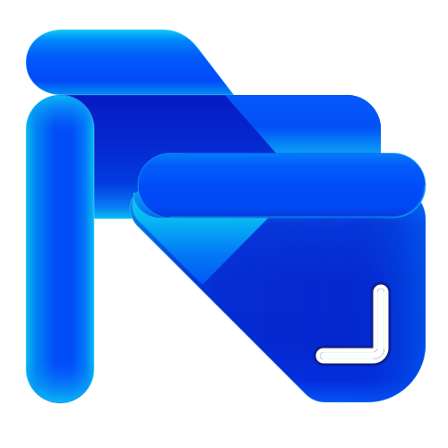

  

<h1 align="center"><a href="https://qtremors.github.io/arcile/">Arcile</a></h1>

  A private, modern Android file manager.

  

  
  
  
  

> [!NOTE]
> **Privacy first:** Arcile does not request `android.permission.INTERNET`. Your files and usage data stay on your device.

## Why Arcile

Arcile is an offline Android file manager built for speed, privacy, and a clean native interface. It has no ads, trackers, accounts, network access, or hidden data collection.

## Download

Download the latest APK from [GitHub Releases](https://github.com/qtremors/arcile/releases) and install it on a device running Android 11 or newer.

Arcile needs Android's all-files access permission for normal full-storage management. It can also use an already authorized Root or Shizuku service for protected locations. Notification permission is requested on supported Android versions so long-running file operations can show progress.

## Features

- **Private and offline:** No ads, accounts, trackers, data collection, or internet permission.
- **Full file browser:** Browse Internal Storage, SD cards, USB drives, and folders available through Android, Root, or Shizuku.
- **Everyday file tools:** Create, search, copy, move, rename, share, delete, restore, and securely erase files. Tabs, split view, batch rename, sorting, and filters are included.
- **Photos, video, and music:** Browse galleries and albums, edit photo details, watch videos with subtitles and gesture controls, and play music in the background.
- **Documents:** Read PDFs, edit text and Markdown, preview formatting, print documents, and open other formats in installed apps.
- **Archives and Android apps:** Open, create, and extract common archives, including password-protected ZIP and 7z files. Inspect and install APK, APKS, APKM, and XAPK packages.
- **Storage tools:** See what uses space and find large, old, duplicate, empty, or unnecessary files.
- **Trash:** Restore deleted files or remove them permanently.
- **OnlyFiles vaults:** Encrypt private files, unlock with a password or biometrics, and safely import, export, view, open, or share them.
- **Personalization:** Customize Home, themes, layouts, shortcuts, thumbnails, and how files open.

> [!WARNING]
> OnlyFiles has not received an independent security audit. Vaults stored inside Arcile are deleted when the app is uninstalled. For long-term storage, use a portable vault and keep a separate backup.
## File format support

Arcile can manage files with any extension, including unknown and custom formats. Built-in handling covers common images and videos supported by the device, audio, text, Markdown, PDF, APK packages, ZIP, 7z, TAR-family archives, GZIP, BZIP2, and XZ. Other formats can be opened, edited, or shared through compatible installed Android apps.

## Community and support

- Join the [Discord community](https://discord.gg/QgUjuNj9U8).
- Report bugs or request features through [GitHub Issues](https://github.com/qtremors/arcile/issues).
- Review changes in the [changelog](CHANGELOG.md) and public [release notes](RELEASES.md).
- Read the [privacy policy](PRIVACY.md).

## Credits

Arcile is built by [Tremors](https://github.com/qtremors) with Kotlin and the Android platform. Thanks to the maintainers of:

- [AndroidX](https://developer.android.com/jetpack/androidx), [Jetpack Compose](https://developer.android.com/compose), [Material 3](https://m3.material.io/), [Room](https://developer.android.com/training/data-storage/room), [DataStore](https://developer.android.com/topic/libraries/architecture/datastore), and [Media3](https://developer.android.com/media/media3)
- [Kotlin](https://kotlinlang.org/), [Kotlin Coroutines](https://github.com/Kotlin/kotlinx.coroutines), [Kotlin Serialization](https://github.com/Kotlin/kotlinx.serialization), and [Immutable Collections](https://github.com/Kotlin/kotlinx.collections.immutable)
- [Dagger and Hilt](https://dagger.dev/hilt/), [Coil](https://coil-kt.github.io/coil/), and [MaterialKolor](https://github.com/jordond/MaterialKolor)
- [Apache Commons Compress](https://commons.apache.org/proper/commons-compress/), [Tukaani XZ for Java](https://tukaani.org/xz/java.html), and [Zip4j](https://github.com/srikanth-lingala/zip4j)
- [Bouncy Castle](https://www.bouncycastle.org/), [Shizuku](https://github.com/RikkaApps/Shizuku-API), and [libsu](https://github.com/topjohnwu/libsu)
- [Tailwind CSS](https://tailwindcss.com/), [Lucide](https://lucide.dev/), [Simple Icons](https://simpleicons.org/), [Roboto](https://fonts.google.com/specimen/Roboto), [Outfit](https://fonts.google.com/specimen/Outfit), and [Material Symbols](https://fonts.google.com/icons) for the project website and visual presentation

The app's **Settings → About → Open Source Licenses** screen lists its runtime libraries and their licenses. Each project remains the property of its respective authors and is used under its own license.

## For developers

Architecture, project structure, technology choices, setup, build commands, testing, release signing, and maintenance guidance live in [DEVELOPMENT.md](DEVELOPMENT.md).

## License

Arcile is source-available under the **Tremors Source License (TSL)**. Viewing, forking, and derivative works require attribution; commercial use requires written permission.

Read [LICENSE.md](LICENSE.md) or the [web version](https://qtremors.github.io/license).

---

  Made by <a href="https://github.com/qtremors">Tremors</a>

